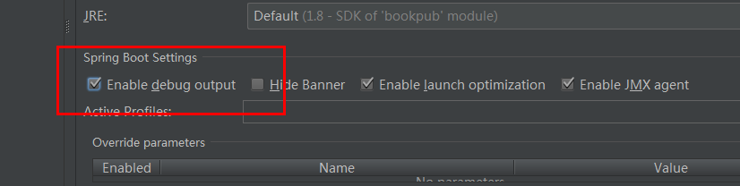
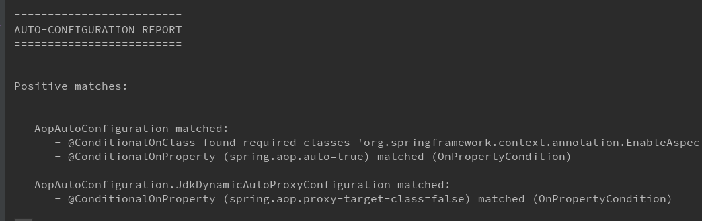

>  个人积累，请勿私自转载，转载前请联系  
>  代码及文章资源[https://github.com/jedyang/DayDayUp/tree/master/java/springboot](https://github.com/jedyang/DayDayUp/tree/master/java/springboot)  
>  基于SpringBootCookBook的读书笔记，重在个人理解和实践，而非翻译。

##编写自己的starter
### 理解springboot的自动配置
使用springboot开发的时候，和以前相比很强烈的感觉是，简单。完全没有xml配置，也没有过多的注解。这种能力与其说是来自spring，倒不如说是来自java的配置能力。  
当我们把一个个starter加到pom里，springboot会对这些依赖进行整合，做出合适的决定，将合适的bean注入的上下文中。  

springboot给我们准备了详细的自动配置报告。  
查看方法是启动时加上DEBUG=true参数。  
如在项目目录下运行DEBUG=true mvn spring-boot:run启动应用程序。  
我是使用的idea。   

启动在控制台可以看到：  

仔细看报告，分为两部分positive match和negative match。  
positive match告诉你匹配的配置类。  
negative match告诉你为什么不匹配。  
在springboot中有很多配置类，在org.springframework.boot.autoconfigure包下。  
比如：  

		@Configuration
		@ConditionalOnClass({ EnableAspectJAutoProxy.class, Aspect.class, Advice.class })
		@ConditionalOnProperty(prefix = "spring.aop", name = "auto", havingValue = "true", matchIfMissing = true)
		public class AopAutoConfiguration {

比如@ConditionalOnClass注解要求检查指定的类是否在classpath中存在。  
@ConditionalOnProperty检查指定的属性是否存在。等等  
满足就是positive match，该配置类会被执行，加载到spring的上下文中。  
不满足就是negative match。

### 创建自己的starter
这一节创建一个自己的starter。 db-count-starter   
starter的作用是创建一个CommandLineRunner,然后打印数据库中书的数目。  

#### 做法
1. starter需要时自己单独的一个项目。新建一个当前mvn工程的子项目。  
加一下依赖。  

		<dependencies>
	        <dependency>
	            <groupId>org.springframework.boot</groupId>
	            <artifactId>spring-boot</artifactId>
	            <!-- version继承父模块的-->
	        </dependency>
	        <dependency>
	            <groupId>org.springframework.data</groupId>
	            <artifactId>spring-data-commons</artifactId>
	            <version>1.9.3.RELEASE</version>
	        </dependency>
	    </dependencies>
2. 新建一个包/bookpubstarter/dbcount
3. 包下新建一个类DbCountRunner。实现CommandLineRunner。

		package org.test.bookpubstarter.dbcount;
		
		import org.slf4j.Logger;
		import org.slf4j.LoggerFactory;
		import org.springframework.boot.CommandLineRunner;
		import org.springframework.data.repository.CrudRepository;
		
		import java.util.Collection;
		
		public class DbCountRunner implements CommandLineRunner {
		    protected final Logger logger = LoggerFactory.getLogger(DbCountRunner.class);
		    private Collection<CrudRepository> repositories;
		
		    public DbCountRunner(Collection<CrudRepository> repositories) {
		        this.repositories = repositories;
		    }
		
		    @Override
		    public void run(String... strings) throws Exception {
		        // lamda 需要jdk8
		        repositories.forEach(crudRepository -> {
		            logger.info(String.format("%s has %s entries",
		                    getRepositoryName(crudRepository.getClass()),
		                    crudRepository.count()));
		        });
		    }
		
		    private static String getRepositoryName(Class crudRepositoryClass) {
		        for (Class repositoryInterface : crudRepositoryClass.getInterfaces()) {
		            if (repositoryInterface.getName().startsWith("org.test.bookpub.repository")) {
		                return repositoryInterface.getSimpleName();
		            }
		        }
		        return "UnknownRepository";
		    }
		}
  

4. 像springboot自己的配置类一样。我们需要给commandLineRunner创建一个配置类。  

		package org.test.bookpubstarter.dbcount;
		
		import org.springframework.context.annotation.Bean;
		import org.springframework.context.annotation.Configuration;
		import org.springframework.data.repository.CrudRepository;
		
		import java.util.Collection;
		
		@Configuration
		public class DbCountAutoConfiguration {
		    @Bean
		    public DbCountRunner dbCountRunner(Collection<CrudRepository> repositories) {
		        return new DbCountRunner(repositories);
		    }
		}

5. 我们需要告诉springboot，我们的jar包里有自动配置文件。  
在main下创建resources/META-INF路径。创建文件spring.factories  
内容是：  

		org.springframework.boot.autoconfigure.EnableAutoConfiguration=org.test.bookpubstarter.dbcount.DbCountAutoConfiguration

6. mvn install一下，发布到本地仓库里

7. 在外层的父pom中加上对starter工程的依赖

		<dependency>
		   <groupId>org.test</groupId>
		   <artifactId>db-count-starter</artifactId>
		   <version>0.0.1-SNAPSHOT</version>
		</dependency>

8. run  

		2017-09-07 10:29:16.737  INFO 4720 --- [           main] o.t.b.dbcount.DbCountRunner              : PublisherRepository has 1 entries
		2017-09-07 10:29:16.739  INFO 4720 --- [           main] o.t.b.dbcount.DbCountRunner              : ReviewerRepository has 0 entries
		2017-09-07 10:29:16.742  INFO 4720 --- [           main] o.t.b.dbcount.DbCountRunner              : AuthorRepository has 1 entries
		2017-09-07 10:29:16.744  INFO 4720 --- [           main] o.t.b.dbcount.DbCountRunner              : BookRepository has 1 entries

可以看到我们的starter已经运行了。

#### 原理
在应用启动的时候，springboot会使用SpringFactoriesLoader类在配置文件中查找org.springframework.boot.autoconfigure.EnableAutoConfiguration关键字标识的配置项。  
Spring Boot会遍历在各个jar包种META-INF目录下的spring.factories文件来查找这个配置。  

除了EnableAutoConfiguration关键字对应的配置文件，还有其他类型的配置文件：

- org.springframework.context.ApplicationContextInitializer
- org.springframework.context.ApplicationListener
- org.springframework.boot.SpringApplicationRunListener
- org.springframework.boot.env.PropertySourceLoader
- org.springframework.boot.autoconfigure.template.TemplateAvailabilityProvider
- org.springframework.test.contex.TestExecutionListener

### 配置bean的初始化
在第一节中，我们知道springboot可以根据一些条件来决定配置是否执行。  
现在我们尝试一下，对上一节中的DbCountRunner进行配置，没有其他DbCountRunner实例时才会创建，一个单例。  

1. 加一个注解  
@ConditionalOnMissingBean意思是不存在这个bean的条件下，方法可以执行

		@Configuration
		public class DbCountAutoConfiguration {
		    @Bean
		    @ConditionalOnMissingBean
		    public DbCountRunner dbCountRunner(Collection<CrudRepository> repositories) {
		        return new DbCountRunner(repositories);
		    }
		}

2. run     
可以看到在positive match中

		DbCountAutoConfiguration#dbCountRunner matched:
		      - @ConditionalOnMissingBean (types: org.test.bookpubstarter.dbcount.DbCountRunner; SearchStrategy: all) did not find any beans (OnBeanCondition)

3. 然后我们在主启动类中增加手动创建一个dbCountRunner  

	    @Bean
	    public DbCountRunner dbCountRunner(Collection<CrudRepository> repositories) {
	        return new DbCountRunner(repositories) {
	            public void run(String... args) throws Exception {
	                logger.info("Manually Declared DbCountRunner");
	            }
	        };
	    }

4. 再试一次  
这次发现在negative match中： 

		DbCountAutoConfiguration#dbCountRunner:
		      Did not match:
		         - @ConditionalOnMissingBean (types: org.test.bookpubstarter.dbcount.DbCountRunner; SearchStrategy: all) found bean 'dbCountRunner' (OnBeanCondition)
		         

### 使用@Enable*注解触发配置  
有时候我们需要一个starter库的消费者明确的定义是否触发starter的配置类，而不是交由springboot去自动决定。  

1. 注释掉spring.factories中自动配置的配置项
2. 创建一个自定义注解

		package org.test.bookpubstarter.dbcount;
		
		import org.springframework.context.annotation.Import;
		
		import java.lang.annotation.Documented;
		import java.lang.annotation.ElementType;
		import java.lang.annotation.Retention;
		import java.lang.annotation.RetentionPolicy;
		import java.lang.annotation.Target;
		
		@Target(ElementType.TYPE)
		@Retention(RetentionPolicy.RUNTIME)
		@Import(DbCountAutoConfiguration.class)
		@Documented
		public @interface EnableDbCounting {
		}
3. 使用新创建的自定义注解@EnableDbCounting去注解主启动类BookPubApplication。    
同时把手动创建DbCountRunner的代码注释掉

		@SpringBootApplication
		@EnableScheduling
		@EnableDbCounting
		public class BookPubApplication {

4. run  
一切正常

一般来说，@Component注解的作用范围就是在BookPubApplication所在的目录以及各个子目录，即com.test.bookpub.*，而DbCountAutoConfiguration是在org.test.bookpubstarter.dbcount目录下，因此不会被扫描到。

@EnableDbCounting注解通过@Import(DbCountAutoConfiguration.class)找到对应的配置类，因此通过用@EnableDbCounting修饰BookPubApplication，就是告诉Spring Boot在启动过程中要把DbCountAutoConfiguration加入到应用上下文中。

这样我们将配置的决定权交给了使用者。  

