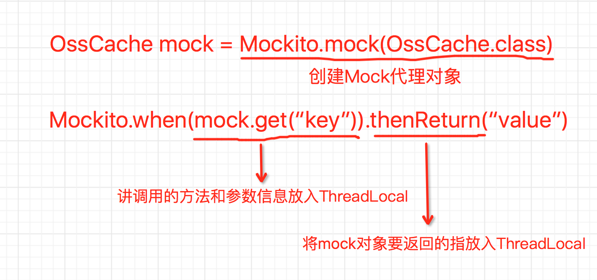

## 单元测试
### 单测定义

单元测试（Unit Testing）又称为模块测试, 是针对程序模块（软件设计的最小单位）来进行正确性检验的测试工作，程序模块在面向对象编程中一般是指方法。

单元测试一般由开发人员来编写，用来保证程序及功能的正确性。

### 为什么需要单测

编写单元测试代码并不是一件容易的事情，那为什么还需要去话费时间和精力来编写单元测试呢？

- 减少Bug：如今的项目大多都是多人分模块协同开发，当各个模块集成时再去发现问题，定位和沟通成本是非常高的，通过单元测试来保证各个模块的正确性，可以尽早的发现问题，而不时等到集成时再发现问题。
- 放心重构：如今持续型的项目越来越多，代码不断的在变化和重构，通过单元测试，开发可以放心的修改重构代码，减少改代码时心理负担，提高重构的成功率。
- 改进设计：越是良好设计的代码，一般越容易编写单元测试，多个小的方法的单测一般比大方法（成百上千行代码）的单测代码要简单、要稳定，一个依赖接口的类一般比依赖具体实现的类容易测试，所以在编写单测的过程中，如果发现单测代码非常难写，一般表明被测试的代码包含了太多的依赖或职责，需要反思代码的合理性，进而推进代码设计的优化，形成正向循环。

就个人而言，感受最深的就是，有了单测后重构代码起来心里压力小多了，其次是通过单测减少了很多低级错误。

### 单测带来的一些问题

单测在解决了一些问题的同时也容易产生一些问题

- 学习成本：单测框架的学习需要一定的成本
- 开发成本：项目初期，往往最重要的是快速上线，时间非常紧张，这时容易出现单测代码难以编写，代码经常变化导致单测代码也需要更着同步变化，一定程度上会拖慢项目的进度，可以在项目中后期再补上重要部分的单测代码
- 推广实行：项目中推广单测有一定成本，单纯为了覆盖率的单测是没什么意义的，所以在项目中推广单测时，要考虑到项目成员是否接受单测，能否编写出较好的单测代码，否则单测容易流于形式，达不到理想的效果。

个人经验，在项目中要施行单测，需要做到以下几点：

- 说服领导，给出合理的考核指标（如单测覆盖率等要求，需要结合现状给出合理的指标）
- 提供单测指标统计的大盘，显示项目单测指标，督促大家完成指标
- 对项目结构配置等进行调整，提供单测工具类，基础类，让单测易编写，能运行，速度快
- 对项目组成员进行单测编写方法分享，使成员熟悉单测技术
- 提供单测代码示例，示例要够复杂，方便成员参考
- 定时检查成员单测代码，提供改进意见，防止流于形式

### 单测工具介绍

#### JUnit

Java用的最多的单测框架，使用非常简单，主流IDE基本都集成了JUnit，具体用法就不介绍了，可以花十分钟看看官方文档[http://junit.org/junit4/](http://junit.org/junit4/) 

##### Runner

JUnit的Runner是指继承了org.junit.runner.Runner的类，是用来真正执行单测方法的类，JUnit有提供默认的Runner，如org.junit.runners.JUnit4，也可以通过@RunWith注解来指定自定义的Runner，如@RunWith(SpringRunner.class)

Runner的介绍可以参考这篇文章：
[http://www.mscharhag.com/java/understanding-junits-runner-architecture](http://www.mscharhag.com/java/understanding-junits-runner-architecture)

通过自定义Runner，可以简化单测的开发，例如，在Spring没有提供Runner时，为Spring应用编写单测，需要自己初始化Spring上下文，然后从上下文中获取要测试的Bean，使用起来比较麻烦。

对于自定义Runner来说，一般会继承JUnit的org.junit.runners.BlockJUnit4ClassRunner，BlockJUnit4ClassRunner主要提供了下面的功能：

- 反射创建单测类实例
- 找出单测方法（被@Test注解的方法）
- 其它JUnit注解支持，如@After、@Before等等
- 反射执行单测方法

SpringRunner通过继承BlockJUnit4ClassRunner，在其基础上提供了自动初始化Spring上下文，单测类中的@Resource等注解的处理，等等一系列方便编写Spring单测的功能。

如果我们想实现在单测方法前后执行一些逻辑，我们除了可以使用@Before注解，还可以通过实现自定Runner来实现：

```
import org.junit.runners.BlockJUnit4ClassRunner;
import org.junit.runners.model.FrameworkMethod;
import org.junit.runners.model.InitializationError;
import org.junit.runners.model.Statement;

public class TestRunner extends BlockJUnit4ClassRunner {

    public TestRunner(Class<?> klass) throws InitializationError {
        super(klass);
    }

    @Override
    protected Statement methodBlock(FrameworkMethod method) {
        //FrameworkMethod 是单测方法的包装类

        //获取父类处理的结果，以便使用JUnit提供的注解的功能
        Statement block = super.methodBlock(method);

        //自定义的逻辑
        Statement newBlock = new Statement() {
            @Override
            public void evaluate() throws Throwable {
                //这里可以在单测方法执行前做一些自定义逻辑
                System.out.println("TestRunner before : " + method.getName());

                block.evaluate();//单测方法执行，包含@Before等注解处理逻辑

                //这里可以在单测方法执行后做一些自定义逻辑
                System.out.println("TestRunner after : " + method.getName());
            }
        };

        return newBlock;
    }

}
import org.junit.Test;
import org.junit.runner.RunWith;

@RunWith(TestRunner.class)
public class BTestClass {

    @Test
    public void test(){
        System.out.println("test b");
    }
    
}

//运行输出
//TestRunner before : test
//test b
//TestRunner after : test

```
在JUnit内部，其实就是用类似的方式来实现@Before、@After等等注解功能的，通过层层的包装Statement类，来实现功能的扩展。

##### Rule

Rule是JUnit4.7新增加的功能，是JUnit的另一种扩展机制，可以扩展单测方法的执行。上面TestRunner的功能也可以通过Rule机制来实现：

```
import org.junit.rules.TestRule;
import org.junit.runner.Description;
import org.junit.runners.model.Statement;

public class EchoRule implements TestRule {

    @Override
    public Statement apply(Statement base, Description description) {
        Statement newBlock = new Statement() {
            @Override
            public void evaluate() throws Throwable {
                //这里可以在单测方法执行前做一些自定义逻辑
                System.out.println("EchoRule before : " + description.getMethodName());

                base.evaluate();//单测方法执行，包含@Before等注解处理逻辑

                //这里可以在单测方法执行后做一些自定义逻辑
                System.out.println("EchoRule after : " + description.getMethodName());
            }
        };
        return newBlock;
    }

}
import org.junit.Rule;
import org.junit.Test;

public class BTestClass {

    @Rule
    public EchoRule rule = new EchoRule();//必需要是public的
    
    @Test
    public void test() {
        System.out.println("test b");
    }

}

//输出
//EchoRule before : test
//test b
//EchoRule after : test
```

可以看到Rule更多的是对单测方法执行前后的一些逻辑的扩展，@Rule注解的属性必需是public的实例属性，如果想在所有单测方法执行前后进行处理（类似@BeforeClass、@AfterClass逻辑），可以通过@ClassRule注解来做到，被@ClassRule的属性必需是static public的属性

Rule机制相对Runner的好处在于，Runner只能指定一个，而一个单测类可以指定多个Rule，Spring也有Rule的实现，在即想使用其它框架的Runner又想使用Spring的单测扩展时，可以使用其它框架的Runner，然后使用Spring的Rule，来组合使用，如：

```
import org.junit.ClassRule;
import org.junit.Rule;
import org.junit.Test;
import org.junit.runner.RunWith;
import org.mockito.runners.MockitoJUnitRunner;
import org.springframework.test.context.junit4.rules.SpringClassRule;
import org.springframework.test.context.junit4.rules.SpringMethodRule;

@RunWith(MockitoJUnitRunner.class)
@ContextConfiguration(locations="classpath:spring-root.xml")
public class BTestClass {

    @ClassRule
    public static final SpringClassRule SPRING_CLASS_RULE = new SpringClassRule();

    @Rule
    public final SpringMethodRule springMethodRule = new SpringMethodRule();

    @Test
    public void test() {
        System.out.println("test b");
    }

}
```

JUnit自带了一些方便使用的Rule实现，可以参考下面的文档
[https://github.com/junit-team/junit4/wiki/Rules](https://github.com/junit-team/junit4/wiki/Rules)

### Mock框架

在真实项目中，往往需要依赖很多外部的接口，如HSF等接口，而我们在运行单测的时候RPC接口可能还未开发完成或者因为环境问题，无法访问，这时我们想要测试自己部分的逻辑，就需要使用到Mock框架，来屏蔽掉外部系统的影响。

使用Mock通常会带来以下一些好处：

- 隔绝其他模块出错引起本模块的测试错误
- 隔绝其他模块的开发状态，只要定义好接口，不用管他们开发有没有完成
- 一些速度较慢的操作，可以用Mock Object代替，使单测快速返回
- 隔离环境对单测执行的影响，实现在没有外部服务时也能运行单测

常见的Mock框架有EasyMock、Mocktio、JMockit、PowerMock等，个人只简单用过Mocktio和JMockit，就功能上，JMockit的功能更强，能Mock静态方法等，但是根据之前的使用来看，比较难以驾驭，因为JMockit使用的是Java5的Instrumentation机制，会在运行时修改字节码，导致碰到问题时比较难以调试，相对的网络资料也比较少，而Mocktio的使用比较简单明了，因此推荐使用Mocktio

关于Mocktio的使用可以参考文档：
[https://static.javadoc.io/org.mockito/mockito-core/2.7.22/org/mockito/Mockito.html
https://juejin.im/entry/578f11aec4c971005e0caf82](https://static.javadoc.io/org.mockito/mockito-core/2.7.22/org/mockito/Mockito.html
https://juejin.im/entry/578f11aec4c971005e0caf82) 

因为Mocktio是使用Cglib来创建代理的，所以对于被Mock的对象来说，要求和Cglib创建代理的要求一样，如不能是final类、不能代理private方法等等限制

有时候可能需要mock void方法，可以使用下面的方式

```
OssCache cache = Mockito.mock(OssCache.class);

Mockito.doNothing().when(cache).putToKey("key", "val");
Mockito.doThrow(new RuntimeException("exp")).when(cache).deleteObj("key");

cache.putToKey("key", "val");
try {
	cache.deleteObj("key");
	fail("mast throw exception");
} catch (RuntimeException e) {
	assertTrue("exp".equals(e.getMessage()));
}

Mockito.verify(cache).putToKey("key", "val");
Mockito.verify(cache).deleteObj("key");
```

当Mockito的注解使用起来比较方便，具体注解的使用参见前面链接的文档，Mockito处理注解是通过MockitoAnnotations.initMocks(target)来处理的，而Mockito提供的Runner和Rule其实就是简单的在单测方法执行前执行该行代码，所以可以通过@RunWith(MockitoJUnitRunner.class)或@Rule public MockitoRule mockitoRule = MockitoJUnit.rule()方式来使用Mockito注解功能，当和Spring Test一起使用时，因为一般会使用Spring的Runner，所以可以通过Rule的方式来使用Mockito的注解功能

关于Mockito的大概原理如下


主要通过ThreadLocal将我们要mock的方法和对应的返回值关联起来

### 内存数据库

在项目中经常会使用到Mysql等数据库，但是在单测运行时，如果访问Mysql等外部服务器，会造成：

- 单测运行慢
- 单测运行依赖环境，在无法访问Mysql时，单测无法运行
- 单测可能会运行的非常频繁，造成Mysql中非常多的垃圾数据
- 单测依赖数据库中某些特定的数据，造成换个Mysql数据库时单测运行失败

那么如何解决上面的问题，一种方式是Mock掉所有DAO的类，这种方式需要写非常多的Mock，单测写起来比较麻烦，且DAO层面问题无法测试到；另一种方式就是使用内存数据库，内存数据库兼容SQL，启动速度快，数据存放在内存中单测运行后自动丢弃，非常适合单测时使用

常见的内存数据库有很多，但是鉴于单测场景，考虑到安装方便（直接Maven依赖），了解到的有HSQL、H2、Derby等，H2的官网上有个对比表[http://www.h2database.com/html/main.html](http://www.h2database.com/html/main.html)


考虑到目前我们使用的是Mysql数据库，而H2有Mysql模式，对Mysql的语法支持的最好，所以建议使用H2数据库来作为单测数据库，但是H2并不支持所有的Mysql语法，还是有不少的Mysql语法或函数并不支持，对于建表语句而言，可以使用语法转换工具[https://github.com/bgranvea/mysql2h2-converter](https://github.com/bgranvea/mysql2h2-converter)


Spring对嵌入式数据库支持的非常好，可以通过下面的配置来创建嵌入式数据库数据源，同时可以指定初始化表和数据库的脚本

```
<jdbc:embedded-database id="dataSource" generate-name="true" type="H2">
	<jdbc:script location="classpath:/sql/test_schema.sql" />
	<jdbc:script location="classpath:/sql/test_init_data.sql" />
</jdbc:embedded-database>
```
具体使用可以参考Spring的文档[https://docs.spring.io/spring/docs/current/spring-framework-reference/html/jdbc.html#jdbc-embedded-database-support](https://docs.spring.io/spring/docs/current/spring-framework-reference/html/jdbc.html#jdbc-embedded-database-support)


除了H2，还可以使用MariaDB4j，MariaDB的Java包装版本（用Java代码安装MariaDB精简版然后启动，比较重）
https://github.com/vorburger/MariaDB4j

### Spring Test介绍

当应用使用了Spring时，编写单测时需要每次手动的初始化Spring上下文，这种方式不仅繁琐，而且不能复用Spring上下文，导致单测执行时间变长，为此，Spring提供了对单测的支持，也就是Spring Test模块

Spring和JUnit的整合，提供了对应的Runner和Rule，我们平常使用的比较多的是Spring的Runner，即SpringJUnit4ClassRunner或者SpringRunner（Spring4.3），Spring的Runner会根据配置自动初始化Spring上下文，并在单测方法执行时对其进行依赖注入，避免手动的getBean操作，简单使用如下

```
@RunWith(SpringJUnit4ClassRunner.class)
@ContextConfiguration("classpath:spring-test-main.xml")
public class Test {

	@Resource
	private SomeBean bean;

	@Test
	public void test(){
		String someVal = bean.someMethod();
	}

}
```
Spring Test提供@ContextConfiguration来让我们指定要初始Spring上下文的配置，支持Spring的各种配置方式，如XML、JavaConfig等等方式，@ContextConfiguration和@RunWith等注解都可以注解在基类上，所以可以提供一个基础类来简化单测的编写

```
@RunWith(SpringJUnit4ClassRunner.class)
@ContextConfiguration("classpath:base-context.xml")
public class XXXTestBase {

}

@ContextConfiguration("classpath:extended-context.xml")
public class YYYTest extends XXXTestBase{

}
```

默认情况下，子类可以基础父类的@ContextConfiguration配置，同时可以追加自己的配置，当程序非常模块化时，可以通过指定特定的配置文件来减少初始化Bean的数量，以便提高单测的执行速度

@TestExecutionListeners注解是Spring Test用来注册TestExecutionListener的注解，提供的类似于JUnit的Before、After的扩展方法，父类的@TestExecutionListeners注解配置通样可以被子类基础，子类也可以提供自己个性的@TestExecutionListeners配置

```
//可以通过@Order指定TestExecutionListener的顺序
public interface TestExecutionListener {
	void beforeTestClass(TestContext testContext) throws Exception;

	void prepareTestInstance(TestContext testContext) throws Exception;

	void beforeTestMethod(TestContext testContext) throws Exception;

	void afterTestMethod(TestContext testContext) throws Exception;

	void afterTestClass(TestContext testContext) throws Exception;
}
```
单测一般不需要显示的配置@TestExecutionListeners注解，默认@ContextConfiguration会自动注册如下Spring Test自带的TestExecutionListener
```
org.springframework.test.context.web.ServletTestExecutionListener
org.springframework.test.context.support.DependencyInjectionTestExecutionListener
org.springframework.test.context.support.DirtiesContextTestExecutionListener
org.springframework.test.context.transaction.TransactionalTestExecutionListener
org.springframework.test.context.jdbc.SqlScriptsTestExecutionListener
```
可以看到，Spring Test很多方便的功能都是通过TestExecutionListener来实现的，比如说DependencyInjectionTestExecutionListener来为单测类实例进行依赖注入的

```
public class DependencyInjectionTestExecutionListener extends AbstractTestExecutionListener {

	@Override
	public void prepareTestInstance(final TestContext testContext) throws Exception {
		if (logger.isDebugEnabled()) {
			logger.debug("Performing dependency injection for test context [" + testContext + "].");
		}
		injectDependencies(testContext);
	}

	protected void injectDependencies(final TestContext testContext) throws Exception {
		Object bean = testContext.getTestInstance();
		AutowireCapableBeanFactory beanFactory = testContext.getApplicationContext().getAutowireCapableBeanFactory();
		beanFactory.autowireBeanProperties(bean, AutowireCapableBeanFactory.AUTOWIRE_NO, false);
		beanFactory.initializeBean(bean, testContext.getTestClass().getName());
		testContext.removeAttribute(REINJECT_DEPENDENCIES_ATTRIBUTE);
	}

}
```

在单测中经常会使用到Mockito的注解，所以可以在单测基础类中使用Mockito的Rule，这样子类就可以使用Mockito的注解了

```
@RunWith(SpringJUnit4ClassRunner.class)
@ContextConfiguration("classpath:base-context.xml")
public class XXXTestBase {
	@Rule
    public MockitoRule rule = MockitoJUnit.rule();
}

@ContextConfiguration("classpath:extended-context.xml")
public class YYYTest extends XXXTestBase{

	@Resource
	@@InjectMocks
	private SpringXXXBean xxxBean;
	
	@Mock
	private XXXHsfBean xxxHsfBean

}
```

在执行单测时，涉及到数据库操作时经常要在单测方法执行前在数据库中准备好单测数据，Spring Test提供了非常方便的注解来在单测方法前初始化数据，如下所示

```
@RunWith(SpringRunner.class)
@ContextConfiguration(locations = "classpath:spring-test-root.xml")
public class BTestClass {

    @Resource
    private TestMapper mapper;

    @Test
    @Sql("BTestClass_testAAA.sql")
	//默认会在BTestClass相同的目录下查找BTestClass_testAAA.sql文件执行
    public void testAAA() {
        List<TestModel> all = mapper.getAll();

        Assert.isTrue(all != null && all.size() == 1);
    }

}
```

@Sql注解可以注解在类上，表示每个单测方法前都执行该SQL脚本，但是要注意单测方法插入到数据库的记录默认并不会在单测执行完后回滚，所以如果SQL脚本中有插入操作，容易出现主键冲突，因为脚本会在每次单测执行时都执行

@Sql可以指定脚本的执行时机，如在单测方法执行前或执行后，通过executionPhase参数控制

在单测时，可能某些单测只能依赖MySQL，可以通过Spring的Profile功能来实现默认使用H2，但可以通过注解的方式来显示给某些单测指使用MYSQL数据源

```
<?xml version="1.0" encoding="UTF-8"?>
<beans xmlns:xsi="http://www.w3.org/2001/XMLSchema-instance" xmlns="http://www.springframework.org/schema/beans" xmlns:context="http://www.springframework.org/schema/context" xmlns:tx="http://www.springframework.org/schema/tx" xmlns:aop="http://www.springframework.org/schema/aop" xmlns:jdbc="http://www.springframework.org/schema/jdbc"
	xsi:schemaLocation="http://www.springframework.org/schema/beans http://www.springframework.org/schema/beans/spring-beans-4.2.xsd
			http://www.springframework.org/schema/context http://www.springframework.org/schema/context/spring-context-4.2.xsd
			http://www.springframework.org/schema/tx http://www.springframework.org/schema/tx/spring-tx-4.2.xsd
			http://www.springframework.org/schema/aop http://www.springframework.org/schema/aop/spring-aop-4.2.xsd
			http://www.springframework.org/schema/jdbc http://www.springframework.org/schema/jdbc/spring-jdbc-4.2.xsd">

	<beans profile="H2">
		<jdbc:embedded-database id="dataSource" generate-name="true" type="H2">
			<jdbc:script location="classpath:/sql/test_schema.sql" />
		</jdbc:embedded-database>
	</beans>

	<beans profile="MYSQL">
		<bean name="dataSource" class="com.alibaba.druid.pool.DruidDataSource" init-method="init" destroy-method="close">
			<property name="url" value="${db.url}" />
			<property name="username" value="${db.username}" />
			<property name="password" value="${db.password}" />
			<!-- mysql jdbc 6.0的driver改包名了 -->
			<property name="driverClassName" value="${db.driver.class}" />
			<property name="initialSize" value="1" />
			<property name="maxActive" value="50" />
			<property name="minIdle" value="1" />
			<property name="maxWait" value="60000" />
			<property name="testOnBorrow" value="false" />
			<property name="testOnReturn" value="false" />
			<property name="testWhileIdle" value="true" />
			<property name="timeBetweenEvictionRunsMillis" value="60000" />
			<property name="minEvictableIdleTimeMillis" value="25200000" />
			<property name="removeAbandoned" value="true" />
			<property name="removeAbandonedTimeout" value="1800" />
			<property name="logAbandoned" value="true" />
			<property name="filters" value="mergeStat" />
		</bean>
	</beans>

</beans>
@RunWith(SpringRunner.class)
@ContextConfiguration(locations = "classpath:spring-test-root.xml")
@ActiveProfiles(profiles = "H2", inheritProfiles = false)
public class BaseTest {

    @Rule
    public MockitoRule rule = MockitoJUnit.rule();

}

@ActiveProfiles(profiles = "MYSQL", inheritProfiles = false)
public class BTestClass extends BaseTest {

    @Resource
    private TestMapper mapper;

    @Test
    @Sql("BTestClass_testAAA.sql")
    public void testAAA() {
        List<TestModel> all = mapper.getAll();

        Assert.isTrue(all != null && all.size() == 1);
    }

}
```

可以通过Spring元注解功能来使代码更语义化一些

```
/**
 * 选择使用H2数据库还是使用Mysql数据库, 底层使用的是Spring的Profile功能
 * 
 * 可以通过
 * 
 * @see spring-test-datasource.xml
 * @author tudesheng
 * @since 2016年9月13日 下午7:02:38
 *
 */
@Documented
@Inherited
@Retention(RetentionPolicy.RUNTIME)
@Target(ElementType.TYPE)
@ActiveProfiles(inheritProfiles = false)
public @interface DBSelecter {

	/**
	 * profiles, 取值只能是DBTypes.H2, 或者是DBTypes.MYSQL, 默认DBTypes.H2
	 */
	@AliasFor(annotation = ActiveProfiles.class, attribute = "profiles")
	String[] value() default { DBTypes.H2 };

	/**
	 * profiles, 取值只能是DBTypes.H2, 或者是DBTypes.MYSQL, 默认DBTypes.H2
	 */
	@AliasFor(annotation = ActiveProfiles.class, attribute = "profiles")
	String[] type() default { DBTypes.H2 };

}

@RunWith(SpringRunner.class)
@ContextConfiguration(locations = "classpath:spring-test-root.xml")
@DBSelecter(DBTypes.H2)
public class BaseTest {

    @Rule
    public MockitoRule rule = MockitoJUnit.rule();

}

@DBSelecter(DBTypes.MYSQL)
public class BTestClass extends BaseTest {

    @Resource
    private TestMapper mapper;

    @Test
    @Sql("BTestClass_testAAA.sql")
    public void testAAA() {
        List<TestModel> all = mapper.getAll();

        Assert.isTrue(all != null && all.size() == 1);
    }

}
```

在使用MYSQL等外部数据库时，单测的执行很容易产生脏数据，可以通过@Rollback注解来标注单测方法执行完后，回滚数据库操作，减少对外部测试数据库的污染

最后，某些单测方法执行后可能会污染Spring的上下文，比如通过反射将某个容器内的Bean的属性给替换调了，可能会对其它的单测造成影响，这个时候，可以通过@DirtiesContext标注该单测方法会污染Spring上下文，需要在单测执行前或执行后重新初始化Spring上下文，慎用，容易增加单测的执行时间

#### 常用工具类

Spring的AopTestUtils：提供了一些获取原始代理对象的接口
Spring的ReflectionTestUtils：提供了一些反射的方便方法，可以用少量的代码来反射修改参数熟悉

工程实践

Demo工程

参考demo工程
http://gitlab.alibaba-inc.com/shengde.tds/unit_test_demo

#### 问题和经验

- Spring Test上下文污染问题：  
某些单测执行时可能会污染Spring上下文，如通过反射修改了Spring上下文中的某些单例对象
可以通过@DirtiesContext标记单测方法，促使Spring Test重新初始Spring上下文
- 时间问题  
单测类中经常有些方法是和时间有关的，不太好测试，这时需要将时间获取API抽象出来
//这个放在src/main/java中，并替换代码中所有获取当前时间代码为Time.currentTimeMillis()

	```
	public abstract class Time {
	
	    private static Time time = new Time() {
	        @Override
	        public long currentTime() {
	            return System.currentTimeMillis();
	        }
	    };
	
	    public static long currentTimeMillis() {
	        return time.currentTime();
	    }
	
	    public abstract long currentTime();
	
	}
	
	//这个放在src/test/java中，专供单测使用，在单测时，通过反射替换掉Time.time静态变量，就可以做到时间可控了
	public class SettableTime extends Time {
	
	    private long time = 0;
	
	    public SettableTime(long time) {
	        super();
	        this.time = time;
	    }
	
	    public SettableTime setTime(long time) {
	        this.time = time;
	        return this;
	    }
	
	    @Override
	    public long currentTime() {
	        return time;
	    }
	
	}
	```

- 外部RPC服务依赖问题  
现在项目中有很多外部的服务依赖，在Spring初始化上下文时需要初始化RPC相关的Bean和服务，这会导致单测执行慢、单测执行依赖外部服务的稳定等问题，所以我们希望在单测的时候不使用外部的服务，同时也不对外提供RPC等服务，可以将外部RPC服务的定义到单独的Spring配置文件，然后在单测中将这些服务定义用Mock实现来替换，HSF通过java接口来定义服务，所以可以很方便的用cglib来创建代理类，替换掉HSF的HSFSpringConsumerBean对象，如：
	
	```
	/**
	 * 外部接口mock类, 方便测试
	 * 
	 * 
	 * @since 2016年6月27日 上午11:21:08
	 *
	 */
	public class MockerFactory<T> implements FactoryBean<T> {
	
		private static final Logger logger = LoggerFactory.getLogger(MockerFactory.class);
	
		private Enhancer enhancer = new Enhancer();
		private Class<T> clazz;
	
		public MockerFactory(Class<T> clazz) {
			this.clazz = clazz;
		}
	
		@Override
		@SuppressWarnings("unchecked")
		public T getObject() throws Exception {
			this.enhancer.setCallback(new MockerInterceptor());
			this.enhancer.setSuperclass(clazz);
			return (T) this.enhancer.create();
		}
	
		@Override
		public Class<?> getObjectType() {
			return clazz;
		}
	
		@Override
		public boolean isSingleton() {
			return true;
		}
	
		private class MockerInterceptor implements MethodInterceptor {
	
			@Override
			public Object intercept(Object obj, Method method, Object[] args, MethodProxy proxy) throws Throwable {
				logger.info("调用Mock, 类:{}, 方法:{}", clazz.getSimpleName(), method.getName());
				return null;
			}
	
		}
	
	}
	
	//xml
	<bean class="com.didichuxing.lang.atlantic.srv.test.util.MockerFactory">
		<constructor-arg index="0" value="xxx.hsf.interface" />
	</bean>
	//这里可以修改MockerFactory的代码，使其的参数和构造方式修改为HSFSpringConsumerBean
	//这样可以简单的替换掉配置文件中的HSFSpringConsumerBean即可
	```

- 一些会通过afterPropertiesSet等初始化外部资源的bean  
某些Spring Bean会通过afterPropertiesSet等方法中初始化MQ获取其它外部的依赖，通常不要将这些类配置为注解方式，而是通过XML配置的方式来使用，这样单测的时候可以非常方便的将其Mock掉，保证单测简单快速的执行
尽量保证Spring配置文件的模块化，如将HSF消费者和HSF提供者单独使用一个Spring配置文件，这样单测只用替换少量的配置即可，不用总是维护两套配置文件，同时执行单测时也可以选择只初始化少量模块，加快单测的执行速度
AutoConfig问题，在阿里非常多的应用使用AutoConfig，但是使用AutoConfig后，因为配置文件是在打包时替换，导致启动时比较麻烦，可以通过将AutoConfig的属性集中成一个properties文件，使用AutoConfig替换该properties文件，然后Spring再使用placeholder的方式来引入被替换的properties文件，这样，在单测的时候，可以方便的使用自己的配置文件来替换掉需要AutoConfig才能替换的文件

其它单测框架

http://blog.2baxb.me/archives/1398