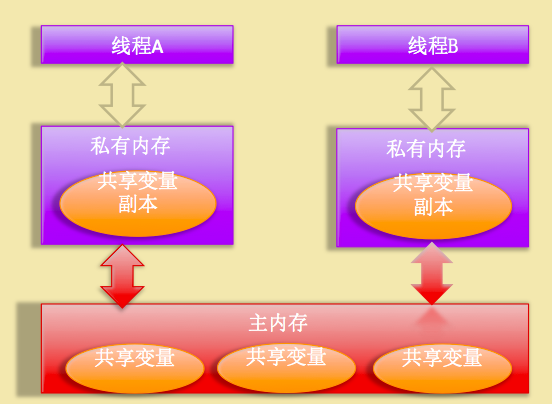
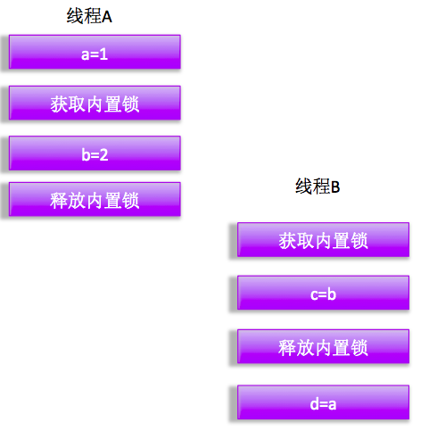
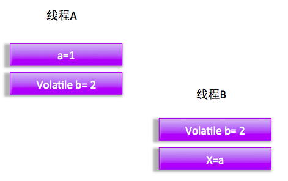
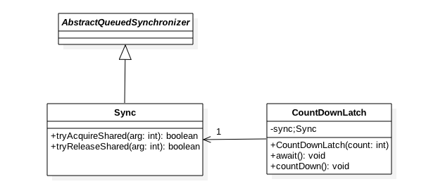
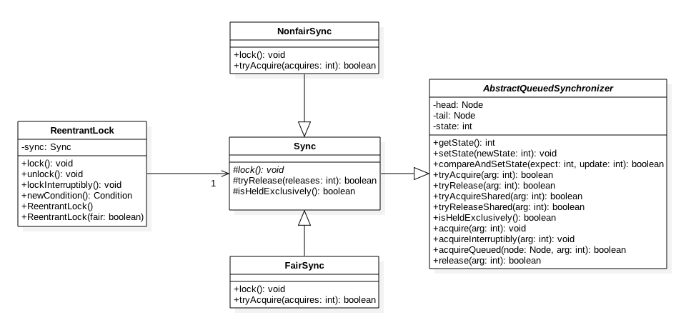
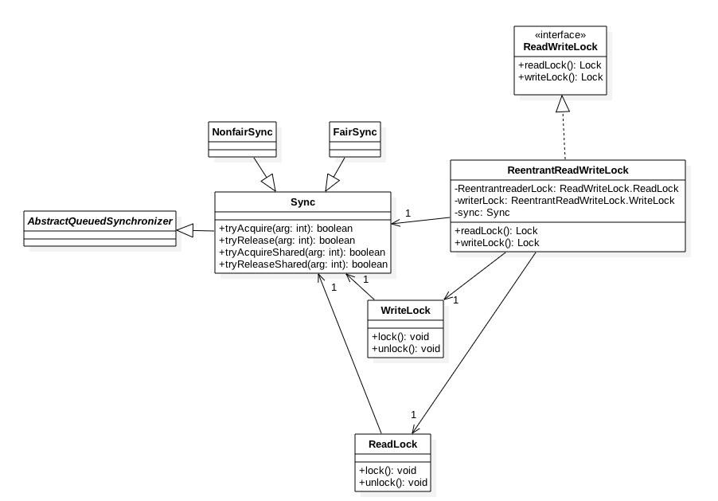

### 一、前言
借用Java并发编程实践中的话"编写正确的程序并不容易，而编写正常的并发程序就更难了"，相比于顺序执行的情况，多线程的线程安全问题是微妙而且出乎意料的，因为在没有进行适当同步的情况下多线程中各个操作的顺序是不可预期的，本文算是对多线程情况下同步策略的一个一个简单介绍。

###二、 什么是线程安全问题
线程安全问题是指当多个线程同时读写一个状态变量，并且没有任何同步措施时候，导致脏数据或者其他不可预见的结果的问题。Java中首要的同步策略是使用Synchronized关键字，它提供了可重入的独占锁。

###三、 什么是共享变量可见性问题
要谈可见性首先需要介绍下多线程处理共享变量时候的Java中内存模型。



Java内存模型规定了所有的变量都存放在主内存中，当线程使用变量时候都是把主内存里面的变量拷贝到了自己的工作内存中的。

当线程操作一个共享变量时候操作流程为：

线程首先从主内存拷贝共享变量到自己的工作内存  
然后对工作内存里的变量进行处理  
处理完后更新变量值到主内存  
那么假如线程A和B同时去处理一个共享变量，会出现什么情况那？  
首先他们都会去走上面的三个流程，假如线程A拷贝共享变量到了工作内存，并且已经对数据进行了更新但是还没有更新会主内存，这时候线程B拷贝共享变量到了自己的工内存进行处理，处理后，线程A才把自己的处理结果更更新到主内存，可知 线程B处理的并不是线程A处理后的结果，也就是说线程A处理后的变量值对线程B不可见，这就是共享变量的可见性问题。  

构成共享变量内存不可见原因是因为三步流程不是原子性操作，下面知道使用恰当同步就可以解决这个问题。  

我们知道ArrayList是线程不安全的，因为他的读写方法没有同步策略，会导致脏数据和不可预期的结果，下面我们就一一讲解如何解决。  

这是线程不安全的

```
public class ArrayList<E> 
{

    public E get(int index) {
        rangeCheck(index);

        return elementData(index);
    }

    public E set(int index, E element) {
        rangeCheck(index);

        E oldValue = elementData(index);
        elementData[index] = element;
        return oldValue;
    }
}
```
###四、原子性
####4.1 介绍  
假设线程A执行操作Ao和线程B执行操作Bo ，那么从A看，当B线程执行Bo操作时候，那么Bo操作全部执行，要么全部不执行，我们称Ao和Bo操作互为原子性操作，在设计计数器时候一般都是先读取当前值，然后+1，然后更新会变量，是读-改-写的过程，这个过程必须是原子性的操作。  

    public class ThreadNotSafeCount {

        private  Long value;

        public Long getCount() {
            return value;
        }

        public void inc() {
            ++value;
        }
    }
如上代码是线程不安全的，因为不能保证++value是原子性操作。方法一是使用Synchronized进行同步如下：  

    public class ThreadSafeCount {

        private  Long value;

        public synchronized Long getCount() {
            return value;
        }

        public synchronized void inc() {
            ++value;
        }
    }
注意，这里不能简单的使用volatile修饰value进行同步，因为变量值依赖了当前值

使用Synchronized确实可以实现线程安全，即实现可见性和同步，但是Synchronized是独占锁，没有获取内部锁的线程会被阻塞掉，那么有没有刚好的实现那？答案是肯定的。

####4.2 原子变量类
原子变量类比锁更轻巧，比如AtomicLong代表了一个Long值，并提供了get,set方法，get，set方法语音和volatile相同，因为AtomicLong内部就是使用了volatile修饰的真正的Long变量。另外提供了原子性的自增自减操作，所以计数器可以改下为：


    public class ThreadSafeCount {

        private  AtomicLong value = new AtomicLong(0L);

        public  Long getCount() {
            return value.get();
        }

        public void inc() {
            value.incrementAndGet();
        }
    }
那么**相比使用synchronized的好处在于原子类操作不会导致线程的挂起和重新调度，因为他内部使用的是cas的非阻塞算法。**

常用的原子类变量为：AtomicLong，AtomicInteger，AtomicBoolean,AtomicReference.

###五 CAS介绍
CAS 即CompareAndSet，也就是比较并设置，CAS有三个操作数分别为：内存位置，旧的预期值，新的值，操作含义是当内存位置的变量值为旧的预期值时候使用新的值替换旧的值。通俗的说就是看内存位置的变量值是不是我给的旧的预期值，如果是则使用我给的新的值替换他，如果不是返回给我旧值。这个是处理器提供的一个原子性指令。上面介绍的AtomicLong的自增就是使用这种方式实现：

    public final long incrementAndGet() {
        for (;;) {
            long current = get();（1）
            long next = current + 1;（2）
            if (compareAndSet(current, next))（3）
                return next;
        }
    }

    public final boolean compareAndSet(long expect, long update) {
        return unsafe.compareAndSwapLong(this, valueOffset, expect, update);
    }

假如当前值为1，那么线程A和检查B同时执行到了（3）时候各自的next都是2，current=1，假如线程A先执行了3，那么这个是原子性操作，会把档期值更新为2并且返回1，if判断true所以incrementAndGet返回2.这时候线程B执行3，因为current=1而当前变量实际值为2,所以if判断为false，继续循环，如果没有其他线程去自增变量的话，这次线程B就会更新变量为3然后退出。

这里使用了无限循环使用CAS进行轮询检查，虽然一定程度浪费了cpu资源，但是相比锁来说避免的线程上下文切换和调度。

###六、什么是可重入锁
当一个线程要获取一个被其他线程占用的锁时候，该线程会被阻塞，那么当一个线程再次获取它自己已经获取的锁时候是否会被阻塞那?如果不需要阻塞那么我们说该锁是可重入锁，也就是锁只要该线程获取了该锁，那么可以无限制次数进入被该锁锁住的代码。

先看一个例子如果锁不是可重入的，看看会出现什么问题。

	public class Hello{
     public Synchronized void helloA(){
        System.out.println("hello");
     }

     public Synchronized void helloB(){
        System.out.println("hello B");
        helloA();
     }

	}
如上面代码当调用helloB函数前会先获取内置锁，然后打印输出，然后调用helloA方法，调用前会先去获取内置锁，如果内置锁不是可重入的那么该调用就会导致死锁了，因为线程持有并等待了锁导致helloB永远不会获取内置锁。

实际上内部锁是可重入锁，例如synchronized关键字管理的方法，可重入锁的原理是在所内部维护了一个线程标示标示该锁目前被那个线程占用，然后关联一个计数器，一开始计数器值为0，说明该锁没有被任何线程占用，当一个线程获取了该锁，计数器会变成1，其他线程在获取该锁时候发现锁的所有者不是自己所以被阻塞，但是当获取该锁的线程再次获取锁时候发现锁拥有者是自己会把计数器值+1， 当释放锁后计数器会-1，当计数器为0时候，锁里面的线程标示重置为null,这时候阻塞的线程会获取被唤醒来获取该锁。

###七、Synchronized关键字
####7.1 Synchronized介绍
synchronized块是Java提供的一种强制性内置锁，每个Java对象都可以隐式的充当一个用于同步的锁的功能，这些内置的锁被称为内部锁或者叫监视器锁，执行代码在进入synchronized代码块前会自动获取内部锁，这时候其他线程访问该同步代码块时候会阻塞掉。拿到内部锁的线程会在正常退出同步代码块或者异常抛出后释放内部锁，这时候阻塞掉的线程才能获取内部锁进入同步代码块。

####7.2 Synchronized同步实例
内部锁是一种互斥锁，具体说是同时已有一个线程可以拿到该锁，当一个线程拿到该锁并且没有释放的情况下，其他线程只能等待。

对于上面说的ArrayList可以使用synchronized进行同步来处理可见性问题。

使用synchronized对方法进行同步

```
public class ArrayList<E>
{

    public synchronized  E get(int index) {
        rangeCheck(index);

        return elementData(index);
    }

    public synchronized E set(int index, E element) {
        rangeCheck(index);

        E oldValue = elementData(index);
        elementData[index] = element;
        return oldValue;
    }
}
```



如图当线程A获取内部锁进入同步代码块后，线程B也准备要进入同步块，但是由于A还没释放锁，所以B现在进入等待，使用同步可以保证线程A获取锁到释放锁期间的变量值对B获取锁后都可见。也就是说当B开始执行A执行的代码同步块时候可以看到A操作的所有变量值，这里具体说是当线程B获取b的值时候能够保证获取的值是2。这时因为线程A进入同步块修改变量值后，会在退出同步块前把值刷新到主内存，而线程B在进入同步块前会首先清空本地内存内容，从主内存重新获取变量值，所以实现了可见性。但是要注意一点所有线程使用的是同一个锁。

注意 **Synchronized关键字会引起现场上下文切换和线程调度。**

###八、 ReentrantReadWriteLock介绍
使用synchronized可以实现同步，但是缺点是同时只有一个线程可以访问共享变量，但是正常情况下，对于多个读操作操作共享变量时候是不需要同步的，synchronized时候无法实现多个读线程同时执行，而大部分情况下读操作次数多于写操作，所以这大大降低了并发性，所以出现了ReentrantReadWriteLock，它可以实现读写分离，运行多个线程同时进行读取，但是最多运行一个写现线程存在。

对于上面的方法现在可以修改为：

```
public class ArrayList<E>
{
  private final ReadWriteLock readWriteLock = new ReentrantReadWriteLock();

  public E get(int index) {

        Lock readLock = readWriteLock.readLock();
        readLock.lock();
        try {
            return list.get(index);
        } finally {
            readLock.unlock();
        }
    }

    public E set(int index, E element) {

        Lock wirteLock = readWriteLock.writeLock();
        wirteLock.lock();
        try {
            return list.set(index, element);
        } finally {
            wirteLock.unlock();
        }
    }
}
```
如代码在get方法时候通过 readWriteLock.readLock()获取了读锁，多个线程可以同时获取这读锁，set方法通过readWriteLock.writeLock()获取了写锁，同时只有一个线程可以获取写锁，其他线程在获取写锁时候会阻塞直到写锁被释放。假如一个线程已经获取了读锁，这时候如果一个线程要获取写锁时候要等待直到释放了读锁，如果一个线程获取了写锁，那么所有获取读锁的线程需要等待直到写锁被释放。所以相比synchronized来说运行多个读者同时存在，所以提高了并发量。  
注意 需要使用者显式调用Lock与unlock操作 

###九、 Volatile变量
对于避免不可见性问题，Java还提供了一种弱形式的同步，即使用了volatile关键字。该关键字确保了对一个变量的更新对其他线程可见。当一个变量被声明为volatile时候，线程写入时候不会把值缓存在寄存器或者或者在其他地方，当线程读取的时候会从主内存重新获取最新值，而不是使用当前线程的拷贝内存变量值。即所谓的内存屏障作用。

volatile虽然提供了可见性保证，但是不能使用他来构建复合的原子性操作，也就是说当一个变量依赖其他变量或者更新变量值时候新值依赖当前老值时候不在适用。与synchronized相似之处在于如图



如图线程A修改了volatile变量b的值，然后线程B读取了改变量值，那么所有A线程在写入变量b值前可见的变量值，在B读取volatile变量b后对线程B都是可见的，途中线程B对A操作的变量a,b的值都可见的。volatile的内存语义和synchronized有类似之处，具体说是说当线程写入了volatile变量值就等价于线程退出synchronized同步块（会把写入到本地内存的变量值同步到主内存），读取volatile变量值就相当于进入同步块（会先清空本地内存变量值，从主内存获取最新值）。

下面的Integer也是线程不安全的，因为没有进行同步措施

    public class ThreadNotSafeInteger {

        private int value;

        public int get() {
            return value;
        }

        public void set(int value) {
            this.value = value;
        }
    }

使用synchronized关键字进行同步如下：

    public class ThreadSafeInteger {

        private int value;

        public synchronized int get() {
            return value;
        }

        public synchronized  void set(int value) {
            this.value = value;
        }
    }
等价于使用volatile进行同步如下：

    public class ThreadSafeInteger {

        private volatile int value;

        public int get() {
            return value;
        }

        public void set(int value) {
            this.value = value;
        }
    }
这里使用synchronized和使用volatile是等价的，但是并不是所有情况下都是等价，一般只有满足下面所有条件才能使用volatile

```
写入变量值时候不依赖变量的当前值，或者能够保证只有一个线程修改变量值。
写入的变量值不依赖其他变量的参与。
读取变量值时候不能因为其他原因进行加锁。
另外 加锁可以同时保证可见性和原子性，而volatile只保证变量值的可见性。
```

为什么volitale不能保证原子性？  
因为volitale只是加了内存屏障，保证了可见性。而不能保证多个操作执行过程中不存在其他线程获取cpu时间片。  

注意 **volatile关键字不会引起线程上下文切换和线程调度。**

###十、 乐观锁与悲观锁
####10.1 悲观锁
悲观锁，指数据被外界修改持保守态度(悲观),在整个数据处理过程中，将数据处于锁定状态。 悲观锁的实现，往往依靠数据库提供的锁机制 。数据库中实现是对数据记录进行操作前，先给记录加排它锁，如果获取锁失败，则说明数据正在被其他线程修改，则等待或者抛出异常。如果加锁成功，则获取记录，对其修改，然后事务提交后释放排它锁。
一个例子：select * from 表 where .. for update;

悲观锁是先加锁再访问策略，处理加锁会让数据库产生额外的开销，还有增加产生死锁的机会，另外在多个线程只读情况下不会产生数据不一致行问题，没必要使用锁，只会增加系统负载，降低并发性，因为当一个事务锁定了该条记录，其他读该记录的事务只能等待。

####10.2 乐观锁
乐观锁是相对悲观锁来说的，它认为数据一般情况下不会造成冲突，所以在访问记录前不会加排他锁，而是在数据进行提交更新的时候，才会正式对数据的冲突与否进行检测，具体说根据update返回的行数让用户决定如何去做。乐观锁并不会使用数据库提供的锁机制，一般在表添加version字段或者使用业务状态来做。

乐观锁直到提交的时候才去锁定，所以不会产生任何锁和死锁。

###十一、独占锁与共享锁
根据锁能够被单个线程还是多个线程共同持有，锁又分为独占锁和共享锁。独占锁保证任何时候都只有一个线程能读写权限，ReentrantLock就是以独占方式实现的互斥锁。共享锁则可以同时有多个读线程，但最多只能有一个写线程，读和写是互斥的，例如ReadWriteLock读写锁，它允许一个资源可以被多线程同时进行读操作，或者被一个线程 写操作，但两者不能同时进行。

独占锁是一种悲观锁，每次访问资源都先加上互斥锁，这限制了并发性，因为读操作并不会影响数据一致性，而独占锁只允许同时一个线程读取数据，其他线程必须等待当前线程释放锁才能进行读取。

共享锁则是一种乐观锁，它放宽了加锁的条件，允许多个线程同时进行读操作。

###十二、公平锁与非公平锁
根据线程获取锁的抢占机制锁可以分为公平锁和非公平锁，公平锁表示线程获取锁的顺序是按照线程加锁的时间先后来分决定的，也就是最早加锁锁的线程将最早获取锁，也就是先来先得的FIFO顺序。而非公平锁则运行闯入，也就是先来不一定先得。

ReentrantLock提供了公平和非公平锁的实现：  
公平锁ReentrantLock pairLock = new ReentrantLock(true);  
非公平锁 ReentrantLock pairLock = new ReentrantLock(false);  
如果构造函数不传递参数，则**默认是非公平锁**。  

在没有公平性需求的前提下尽量使用非公平锁，**因为公平锁会带来性能开销**。
假设线程A已经持有了锁，这时候线程B请求该锁将会被挂起，当线程A释放锁后，假如当前有线程C也需要获取该锁，如果采用非公平锁方式，则根据线程调度策略线程B和C两者之一可能获取锁，这时候不需要任何其他干涉，如果使用公平锁则需要把C挂起，让B获取当前锁。

###十三、 AbstractQueuedSynchronizer介绍
AbstractQueuedSynchronizer提供了一个队列，大多数开发者可能从来不会直接用到AQS，AQS中这个单一的状态信息 state,可以通过protected的getState,setState,compareAndSetState函数进行调用。对于ReentrantLock来说，state可以用来表示该线程获可重入锁的次数，semaphore来说state用来表示当前可用信号的个数，FutuerTask用来表示任务状态（例如还没开始，运行，完成，取消）。

###十四、CountDownLatch原理
####14.1 一个例子
```
public class Test {

    private static final int ThreadNum = 10;

    public static void main(String[] args)  {

        //创建一个CountDownLatch实例，管理计数为ThreadNum
        CountDownLatch countDownLatch = new CountDownLatch(ThreadNum);

        //创建一个固定大小的线程池
        ExecutorService executor = Executors.newFixedThreadPool(ThreadNum);

        //添加线程到线程池
        for(int i =0;i<ThreadNum;++i){
            executor.execute(new Person(countDownLatch, i+1));
        }

        System.out.println("开始等待全员签到...");

        try {
            //等待所有线程执行完毕
            countDownLatch.await();
            System.out.println("签到完毕，开始吃饭");

        } catch (InterruptedException e) {
            e.printStackTrace();
        }finally {
            executor.shutdown();
        }

    }

    static class Person implements Runnable{

        private CountDownLatch countDownLatch;
        private int index;

        public Person(CountDownLatch cdl,int index){
            this.countDownLatch = cdl;
            this.index = index;
        }

        @Override
        public void run() {

            try {
                Thread.sleep(1000);
            } catch (InterruptedException e) {
                // TODO Auto-generated catch block
                e.printStackTrace();
            }
            System.out.println("person " + index +"签到");

            //线程执行完毕，计数器减一
            countDownLatch.countDown();

        }

    }
}
```
如上代码，创建一个线程池和CountDownLatch实例，每个线程通过构造函数传入CountDownLatch的实例，主线程通过await等待线程池里面线程任务全部执行完毕，子线程则执行完毕后调用countDown计数器减一，等所有子线程执行完毕后，主线程的await才会返回。

####14.2 原理
先看下类图：


可知CountDownLatch内部还是使用AQS实现的。
首先通过构造函数初始化AQS的状态值


    public CountDownLatch(int count) {
        if (count < 0) throw new IllegalArgumentException("count < 0");
        this.sync = new Sync(count);
    }
        Sync(int count) {
            setState(count);
        }
然后看下await方法：

```
    public final void acquireSharedInterruptibly(int arg)
            throws InterruptedException {
        //如果线程被中断则抛异常
        if (Thread.interrupted())
            throw new InterruptedException();
        //尝试看当前是否计数值为0，为0则直接返回，否者进入队列等待
        if (tryAcquireShared(arg) < 0)
            doAcquireSharedInterruptibly(arg);
    }

 protected int tryAcquireShared(int acquires) {
            return (getState() == 0) ? 1 : -1;
        }
```
如果tryAcquireShared返回-1则 进入doAcquireSharedInterruptibly

```
    private void doAcquireSharedInterruptibly(int arg)
        throws InterruptedException {
       //加入队列状态为共享节点
        final Node node = addWaiter(Node.SHARED);
        boolean failed = true;
        try {
            for (;;) {
                final Node p = node.predecessor();
                if (p == head) {
                    int r = tryAcquireShared(arg);
                    if (r >= 0) {
                       //如果多个线程调用了await被放入队列则一个个返回。
                        setHeadAndPropagate(node, r);
                        p.next = null; // help GC
                        failed = false;
                        return;
                    }
                }
                //shouldParkAfterFailedAcquire会把当前节点状态变为SIGNAL类型，然后调用park方法把当先线程挂起，
                if (shouldParkAfterFailedAcquire(p, node) &&
                    parkAndCheckInterrupt())
                    throw new InterruptedException();
            }
        } finally {
            if (failed)
                cancelAcquire(node);
        }
    }
```
调用await后，当前线程会被阻塞，知道所有子线程调用了countdown方法，并在在计数为0时候调用该线程unpark方法激活线程，然后该线程重新tryAcquireShared会返回1。

然后看下 countDown方法：

委托给sync

```
    public void countDown() {
        sync.releaseShared(1);
    }
    public final boolean releaseShared(int arg) {
        if (tryReleaseShared(arg)) {
            doReleaseShared();
            return true;
        }
        return false;
    }
```
    
首先看下tryReleaseShared


```
        protected boolean tryReleaseShared(int releases) {
            //循环进行cas，直到当前线程成功完成cas使计数值（状态值state）减一更新到state
            for (;;) {
                int c = getState();
                if (c == 0)
                    return false;
                int nextc = c-1;
                if (compareAndSetState(c, nextc))
                    return nextc == 0;
            }
        }
```

该函数一直返回false直到当前计数器为0时候才返回true。
返回true后会调用doReleaseShared，该函数主要作用是调用uppark方法激活调用await的线程，代码如下：


```
private void doReleaseShared() {

    for (;;) {
        Node h = head;
        if (h != null && h != tail) {
            int ws = h.waitStatus;
            //节点类型为SIGNAL，把类型在通过cas设置回去，然后调用unpark激活调用await的线程
            if (ws == Node.SIGNAL) {
                if (!compareAndSetWaitStatus(h, Node.SIGNAL, 0))
                    continue;            // loop to recheck cases
                unparkSuccessor(h);
            }
            else if (ws == 0 &&
                     !compareAndSetWaitStatus(h, 0, Node.PROPAGATE))
                continue;                // loop on failed CAS
        }
        if (h == head)                   // loop if head changed
            break;
    }
}
```


激活主线程后，主线程会在调用tryAcquireShared获取锁。

###十五、ReentrantLock独占锁原理
####15.1 ReentrantLock结构
先上类图：



可知ReentrantLock最终还是使用AQS来实现，并且根据参数决定内部是公平还是非公平锁，默认是非公平锁

```
 public ReentrantLock() {
        sync = new NonfairSync();
    }

    public ReentrantLock(boolean fair) {
        sync = fair ? new FairSync() : new NonfairSync();
    }
加锁代码：


public void lock() {
        sync.lock();
    }

```

###15.2 公平锁原理
先看Lock方法：
lock方法最终调用FairSync重写的tryAcquire方法

```
        protected final boolean tryAcquire(int acquires) {
            //获取当前线程和状态值
            final Thread current = Thread.currentThread();
            int c = getState();
           //状态为0说明该锁未被任何线程持有
            if (c == 0) {
             //为了实现公平，首先看队列里面是否有节点，有的话再看节点所属线程是不是当前线程，是的话hasQueuedPredecessors返回false,然后使用原子操作compareAndSetState保证一个线程更新状态为1，设置排他锁归属与当前线程。其他线程通过cass则返回false.
                if (!hasQueuedPredecessors() &&
                    compareAndSetState(0, acquires)) {
                    setExclusiveOwnerThread(current);
                    return true;
                }
            }
//状态不为0说明该锁已经被线程持有，则看是否是当前线程持有，是则重入锁次数+1.
            else if (current == getExclusiveOwnerThread()) {
                int nextc = c + acquires;
                if (nextc < 0)
                    throw new Error("Maximum lock count exceeded");

                setState(nextc);
                return true;
            }
            return false;
        }
    }
```
    
公平性保证代码：


```
    public final boolean hasQueuedPredecessors() {

        Node t = tail; // Read fields in reverse initialization order
        Node h = head;
        Node s;
        return h != t &&
            ((s = h.next) == null || s.thread != Thread.currentThread());
    }
```

再看看unLock方法，最终调用了Sync的tryRelease方法：

```
        protected final boolean tryRelease(int releases) {
           //如果不是锁持有者调用UNlock则抛出异常。
            int c = getState() - releases;
            if (Thread.currentThread() != getExclusiveOwnerThread())
                throw new IllegalMonitorStateException();
            boolean free = false;
           //如果当前可重入次数为0，则清空锁持有线程
            if (c == 0) {
                free = true;
                setExclusiveOwnerThread(null);
            }
            //设置可重入次数为原始值-1
            setState(c);
            return free;
        }
```
####15.3 非公平锁原理

```
        final void lock() {

           //如果当前锁空闲0，则设置状态为1，并且设置当前线程为锁持有者
            if (compareAndSetState(0, 1))
                setExclusiveOwnerThread(Thread.currentThread());
            else
                acquire(1);//调用重写的tryAcquire方法-》nonfairTryAcquire方法
        }
 final boolean nonfairTryAcquire(int acquires) {
            final Thread current = Thread.currentThread();
            int c = getState();
            if (c == 0) {//状态为0说明没有线程持有该锁
                if (compareAndSetState(0, acquires)) {//cass原子性操作，保证只有一个线程可以设置状态
                    setExclusiveOwnerThread(current);//设置锁所有者
                    return true;
                }
            }//如果当前线程是锁持有者则可重入锁计数+1
            else if (current == getExclusiveOwnerThread()) {
                int nextc = c + acquires;
                if (nextc < 0) // overflow
                    throw new Error("Maximum lock count exceeded");
                setState(nextc);
                return true;
            }
            return false;
        }
```

####15.3 总结
可知公平与非公平都是先执行tryAcquire尝试获取锁，如果成功则直接获取锁，如果不成功则把当前线程放入队列。对于放入队列里面的第一个线程A在unpark后会进行自旋调用tryAcquire尝试获取锁，假如这时候有一个线程B执行了lock操作，那么也会调用tryAcquire方法尝试获取锁，但是线程B并不在队列里面，但是线程B有可能比线程A优先获取到锁，也就是说虽然线程A先请求的锁，但是却有可能没有B先获取锁，这是非公平锁实现。而公平锁要保证线程A要比线程B先获取锁。所以公平锁相比非公平锁在tryAcquire里面添加了hasQueuedPredecessors方法用来保证公平性。

###十六、ReentrantReadWriteLock原理


如图读写锁内部维护了一个ReadLock和WriteLock，并且也提供了公平和非公平的实现，下面只介绍下非公平的读写锁实现。我们知道AQS里面只维护了一个state状态，而ReentrantReadWriteLock则需要维护读状态和写状态，一个state是无法表示写和读状态的。所以ReentrantReadWriteLock使用state的高16位表示读状态也就是读线程的个数，低16位表示写锁可重入量。

`static final int SHARED_SHIFT   = 16;`

共享锁（读锁）状态单位值65536   
`static final int SHARED_UNIT    = (1 << SHARED_SHIFT);  `  
共享锁线程最大个数65535  
`static final int MAX_COUNT      = (1 << SHARED_SHIFT) - 1;`  

排它锁(写锁)掩码 二进制 15个1  
`static final int EXCLUSIVE_MASK = (1 << SHARED_SHIFT) - 1;`  

返回读锁线程数  
`static int sharedCount(int c)    { return c >>> SHARED_SHIFT; }`  
返回写锁可重入个数   
`static int exclusiveCount(int c) { return c & EXCLUSIVE_MASK; }`  

####16.1 WriteLock
lock 获取锁 对应写锁只需要分析下Sync的tryAcquire和tryRelease 

```
protected final boolean tryAcquire(int acquires) {

        Thread current = Thread.currentThread();
        int c = getState();
        int w = exclusiveCount(c);
        //c!=0说明读锁或者写锁已经被某线程获取
        if (c != 0) {
            //w=0说明已经有线程获取了读锁或者w!=0并且当前线程不是写锁拥有者，则返回false
            if (w == 0 || current != getExclusiveOwnerThread())
                return false;
           //说明某线程获取了写锁，判断可重入个数
            if (w + exclusiveCount(acquires) > MAX_COUNT)
                throw new Error("Maximum lock count exceeded");

           // 设置可重入数量(1)
            setState(c + acquires);
            return true;
        }

       //第一个写线程获取写锁
        if (writerShouldBlock() ||
            !compareAndSetState(c, c + acquires))
            return false;
        setExclusiveOwnerThread(current);
        return true;
    }
```

unlock 释放锁

```
protected final boolean tryRelease(int releases) {
     // 看是否是写锁拥有者调用的unlock
            if (!isHeldExclusively())
                throw new IllegalMonitorStateException();
//获取可重入值，这里没有考虑高16位，因为写锁时候读锁状态值肯定为0
            int nextc = getState() - releases;
            boolean free = exclusiveCount(nextc) == 0;
       //如果写锁可重入值为0则释放锁，否者只是简单更新状态值。
            if (free)
                setExclusiveOwnerThread(null);
            setState(nextc);
            return free;
        }
```

#### 16.2 ReadLock
对应读锁只需要分析下Sync的tryAcquireShared和tryReleaseShared

lock 获取锁

```
protected final int tryAcquireShared(int unused) {

//获取当前状态值
Thread current = Thread.currentThread();
int c = getState();

//如果写锁计数不为0说明已经有线程获取了写锁，然后看是不是当前线程获取的写锁。
if (exclusiveCount(c) != 0 &&
    getExclusiveOwnerThread() != current)
    return -1;

//获取读锁计数
int r = sharedCount(c);
//尝试获取锁，多个读线程只有一个会成功，不成功的进入下面fullTryAcquireShared进行重试
if (!readerShouldBlock() &&
    r < MAX_COUNT &&
    compareAndSetState(c, c + SHARED_UNIT)) {
    if (r == 0) {
        firstReader = current;
        firstReaderHoldCount = 1;
    } else if (firstReader == current) {
        firstReaderHoldCount++;
    } else {
        HoldCounter rh = cachedHoldCounter;
        if (rh == null || rh.tid != current.getId())
            cachedHoldCounter = rh = readHolds.get();
        else if (rh.count == 0)
            readHolds.set(rh);
        rh.count++;
    }
    return 1;
}
return fullTryAcquireShared(current);
}
```

unlock 释放锁

```
protected final boolean tryReleaseShared(int unused) {
Thread current = Thread.currentThread();
if (firstReader == current) {
    // assert firstReaderHoldCount > 0;
    if (firstReaderHoldCount == 1)
        firstReader = null;
    else
        firstReaderHoldCount--;
} else {
    HoldCounter rh = cachedHoldCounter;
    if (rh == null || rh.tid != current.getId())
        rh = readHolds.get();
    int count = rh.count;
    if (count <= 1) {
        readHolds.remove();
        if (count <= 0)
            throw unmatchedUnlockException();
    }
    --rh.count;
}

//循环直到自己的读计数-1 cas更新成功
for (;;) {
    int c = getState();
    int nextc = c - SHARED_UNIT;
    if (compareAndSetState(c, nextc))

        return nextc == 0;
}
}
```
###十七、参考
Java并发编程实践  
http://www.hollischuang.com/archives/934  
http://ifeve.com/juc-reentrantreadwritelock/  