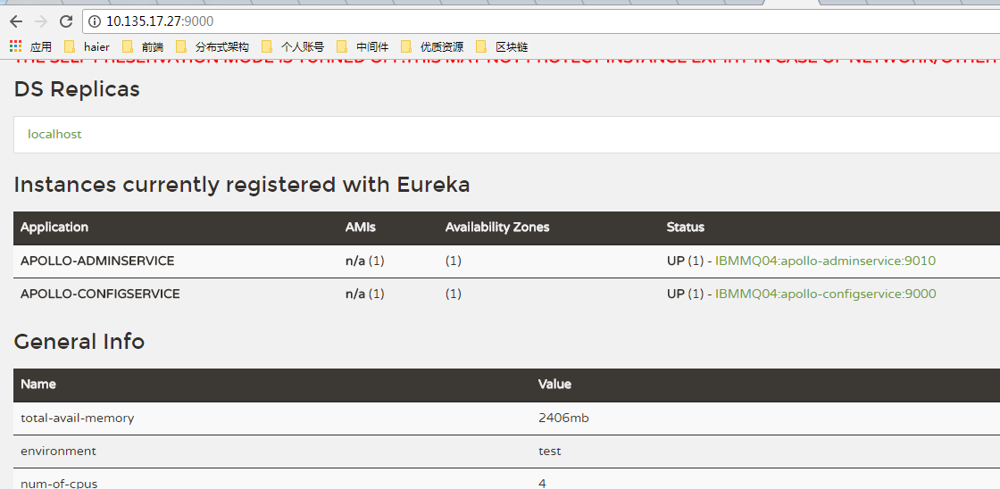
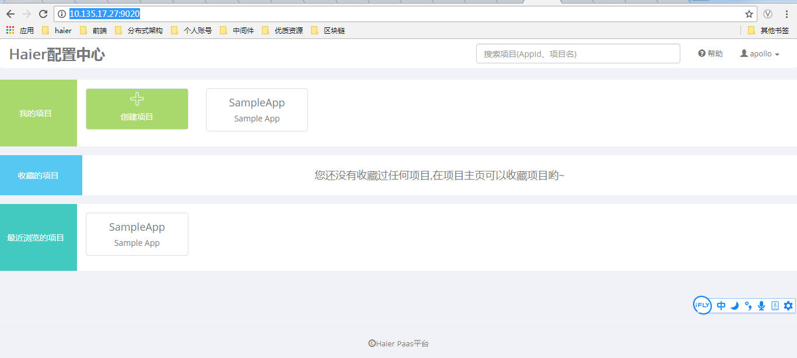

## Apollo系统搭建

### 源文件上传
- rz 文件上传至堡垒机
- scp 文件从堡垒机复制到服务器
 
	    [haieradmin@TYFFHOP01 apollo]$ scp apo* root@10.135.17.27:/root/apollo
    

### 安装jdk
1. 使用scp传到服务器
2. 解压tar.gz 文件
3. 配置jdk环境变量

		[apollo@IBMMQ04 bin]$ vim ~/.bashrc

		# .bashrc
		
		# Source global definitions
		if [ -f /etc/bashrc ]; then
		        . /etc/bashrc
		fi
		
		# User specific aliases and functions
		export JAVA_HOME=/home/apollo/jdk1.8.0_144
		export JAVA_BIN=$JAVA_HOME/bin
		export JAVA_LIB=$JAVA_HOME/lib
		export CLASSPATH=.:$JAVA_LIB/tools.jar:$JAVA_LIB/dt.jar
		export PATH=$JAVA_BIN:$PATH
		~                                                                                      
		~                                                                                      
		~                         
4. 使jdk环境变量生效

		[apollo@IBMMQ04 bin]$ source ~/.bashrc

5. 检查jdk是否生效

		[apollo@IBMMQ04 bin]$ java -version
		java version "1.8.0_144"
		Java(TM) SE Runtime Environment (build 1.8.0_144-b01)
		Java HotSpot(TM) 64-Bit Server VM (build 25.144-b01, mixed mode)
### 安装mysql
不说了，因为我是直接用的已经安好的。。。

### 初始化数据库

### 部署apollo
注意，部署adminService时，因为需要向/opt下写log文件。  
所以如果没有权限会启动失败。  

config上有注册中心  改为9000 注意8080修改的地方很多，还有数据库配置表apolloconfigdb.serverconfig

admin 端口改为 9010

portal 端口改为 9020

#### 解压
	
	[root@IBMMQ04 apollo]# unzip apollo-adminservice-0.9.0-SNAPSHOT-github.zip -d admin_service
	
	unzip apollo-configservice-0.9.0-SNAPSHOT-github.zip -d config_service
	
	unzip apollo-portal-0.9.0-SNAPSHOT-github.zip -d portal_service

#### 启动
	[root@IBMMQ04 apollo]# cd config_service/
	[root@IBMMQ04 config_service]# ./scripts/startup.sh 
	Thu Aug 31 10:42:45 CST 2017 ==== Starting ==== 
	Started [24516]
	Waiting for server startup...........
	Thu Aug 31 10:43:44 CST 2017 Server started in 55 seconds!
	[root@IBMMQ04 config_service]# cd ..
	[root@IBMMQ04 apollo]# ./admin_service/scripts/startup.sh 
	Thu Aug 31 10:46:20 CST 2017 ==== Starting ==== 
	Started [28257]
	Waiting for server startup................
	Thu Aug 31 10:47:42 CST 2017 Server started in 80 seconds!
	[root@IBMMQ04 apollo]# ./portal_service/scripts/startup.sh 
	Thu Aug 31 10:49:01 CST 2017 ==== Starting ==== 
	Started [30879]
	Waiting for server startup.........
	Thu Aug 31 10:49:48 CST 2017 Server started in 45 seconds!
	[root@IBMMQ04 apollo]# 

tips：如果ApolloConfigDB.ServerConfig的eureka.service.url只配了当前正在启动的机器的话，在启动apollo-configservice的过程中会在日志中输出eureka注册失败的信息，如com.sun.jersey.api.client.ClientHandlerException: java.net.ConnectException: Connection refused。需要注意的是，这个是预期的情况，因为apollo-configservice需要向Meta Server（它自己）注册服务，但是因为在启动过程中，自己还没起来，所以会报这个错。后面会进行重试的动作，所以等自己服务起来后就会注册正常了。

	 Caused by: java.net.ConnectException: Connection refused (Connection refused)
	        at java.net.PlainSocketImpl.socketConnect(Native Method)
	        at java.net.AbstractPlainSocketImpl.doConnect(AbstractPlainSocketImpl.java:350)
	        at java.net.AbstractPlainSocketImpl.connectToAddress(AbstractPlainSocketImpl.java:206)
	        at java.net.AbstractPlainSocketImpl.connect(AbstractPlainSocketImpl.java:188)

日志在：
/opt/logs/下
像100003171也可以改下  

#### portal
查看http://10.135.17.27:9020/

现在功能已经基本可用了。  
还存在的一个问题是用户系统。  
有两个方案，1是接入公司的sso。  
2是简单自建一个。下面讲自建的步骤。  
#### 建立账号体系

2. 在ApolloPortalDB创建用户相关的表
		
		CREATE TABLE `users` (
		  `Id` int(10) unsigned NOT NULL AUTO_INCREMENT COMMENT '自增Id',
		  `username` varchar(64) NOT NULL DEFAULT 'default' COMMENT '用户名',
		  `password` varchar(64) NOT NULL DEFAULT 'default' COMMENT '密码',
		  `enabled` tinyint(4) DEFAULT NULL COMMENT '是否有效',
		  PRIMARY KEY (`Id`)
		) ENGINE=InnoDB AUTO_INCREMENT=6 DEFAULT CHARSET=utf8 COMMENT='用户表';
		
		CREATE TABLE `authorities` (
		  `Id` int(11) unsigned NOT NULL AUTO_INCREMENT COMMENT '自增Id',
		  `username` varchar(50) NOT NULL,
		  `authority` varchar(50) NOT NULL,
		  PRIMARY KEY (`Id`)
		) ENGINE=InnoDB AUTO_INCREMENT=6 DEFAULT CHARSET=utf8mb4;
3. 初始化原始用户

		INSERT INTO `users` ( `username`, `password`, `enabled`)
		VALUES
			('admin', '$2a$10$7r20uS.BQ9uBpf3Baj3uQOZvMVvB1RN3PYoKE94gtz2.WAOuiiwXS', 1);
			
		INSERT INTO `authorities` (`username`, `authority`) VALUES ('admin', 'ROLE_user');
原始用户账号：admin 密码：admin

4. 重启Portal

5. 给admin账号添加超级管理员权限  
修改portal db的serverconfig表的superAdmin字段，多个超级管理员之间英文逗号隔开。例如 apollo,admin

6. 添加用户  
输入原始账号密码登录系统。在 http://{portal地址}/user-manage.html 页面添加用户，只有超级管理员才能添加用户， 否则会报403错误

7. 登出  
basic认证没有登出功能，关闭浏览器就会注销登录信息。