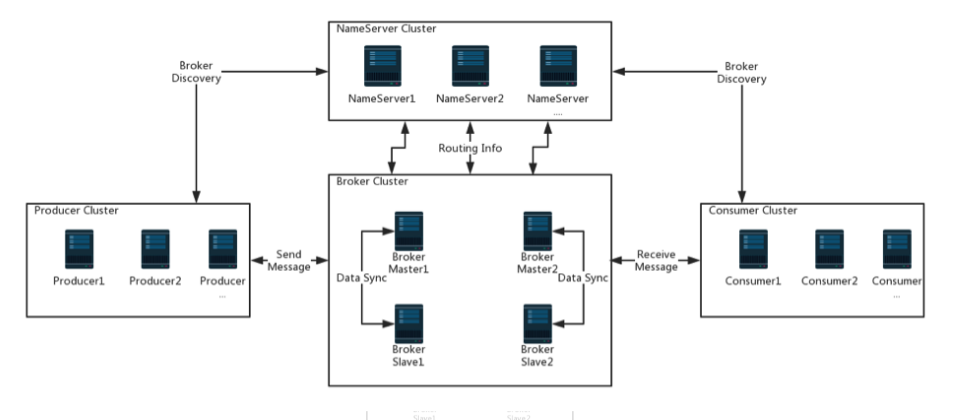

> 原创文章，转载请联系

## RocketMq入门

RocketMq是一种消息中间件，作用是业务相互调用时解耦。可以想象有一个消息的大池子，消息的生产者只要将消息丢到池子里即可。消息的消费者可以被动收到消息或者主动定时去池子里找消息，分别对应了消息系统设计上的推和拉模型。   
这么多消息在一起肯定要做区分，所以设计了topic和tag做分组的标识。
topic是订阅的最小单位，更细的可以用tag在消费端过滤。  
这个大池子就是Broker。  
为了方便生产者和消费者找到这个池子（路由），设计了一个叫Name Server的角色。  
RocketMq的角色还是比较清晰的：  

### 发送消息

Rocket发送消息三种方式：同步、异步、单向传播。  

#### 同步的例子：  

	package com.yunsheng.simpleOrder;
	
	import com.alibaba.rocketmq.client.producer.DefaultMQProducer;
	import com.alibaba.rocketmq.client.producer.SendResult;
	import com.alibaba.rocketmq.common.message.Message;
	import com.alibaba.rocketmq.remoting.common.RemotingHelper;
	
	public class SyncProducer {
	    public static void main(String[] args) throws Exception {
	        //Instantiate with a producer group name.
	        DefaultMQProducer producer = new
	                DefaultMQProducer("produce1");
	
	        producer.setNamesrvAddr("10.135.17.26:9876;10.135.17.27:9876");
	        producer.setVipChannelEnabled(false);
	        //Launch the instance.
	        producer.start();
	        for (int i = 0; i < 10; i++) {
	            //Create a message instance, specifying topic, tag and message body.
	            Message msg = new Message("TopicTest", "TagA",
	                    ("Hello RocketMQ " + i).getBytes(RemotingHelper.DEFAULT_CHARSET)
	            );
	            //Call send message to deliver message to one of brokers.
	            SendResult sendResult = producer.send(msg);
	            System.out.printf("%s%n", sendResult);
	        }
	        //Shut down once the producer instance is not longer in use.
	        producer.shutdown();
	    }
	}

我使用的client版本是3.6.2,从3.4.*开始，默认开启了VIP通道，VIP通道端口为10911-2=10909。若Rocket服务器未启动端口10909，则报connect to <：10909> failed。  
这里要加producer.setVipChannelEnabled(false);

同理，consumer也要加这一句。

	package com.yunsheng.simpleOrder;
	
	import com.alibaba.rocketmq.client.consumer.DefaultMQPushConsumer;
	import com.alibaba.rocketmq.client.consumer.listener.ConsumeConcurrentlyContext;
	import com.alibaba.rocketmq.client.consumer.listener.ConsumeConcurrentlyStatus;
	import com.alibaba.rocketmq.client.consumer.listener.MessageListenerConcurrently;
	import com.alibaba.rocketmq.client.exception.MQClientException;
	import com.alibaba.rocketmq.common.consumer.ConsumeFromWhere;
	import com.alibaba.rocketmq.common.message.MessageExt;
	
	import java.util.List;
	
	public class SyncConsumer {
	
	    public static void main(String[] args) throws InterruptedException, MQClientException {
	
	        //声明并初始化一个consumer
	        DefaultMQPushConsumer consumer = new DefaultMQPushConsumer("consumer1");
	        consumer.setNamesrvAddr("10.135.17.26:9876;10.135.17.27:9876");
	        consumer.setVipChannelEnabled(false);
	
	        //这里设置的是一个consumer的消费策略
	        //CONSUME_FROM_LAST_OFFSET 默认策略，从该队列最尾开始消费，即跳过历史消息
	        //CONSUME_FROM_FIRST_OFFSET 从队列最开始开始消费，即历史消息（还储存在broker的）全部消费一遍
	        //CONSUME_FROM_TIMESTAMP 从某个时间点开始消费，和setConsumeTimestamp()配合使用，默认是半个小时以前
	        consumer.setConsumeFromWhere(ConsumeFromWhere.CONSUME_FROM_FIRST_OFFSET);
	
	        //设置consumer所订阅的Topic和Tag，*代表全部的Tag
	        consumer.subscribe("TopicTest", "TagA");
	
	        //设置一个Listener，主要进行消息的逻辑处理
	        consumer.registerMessageListener(new MessageListenerConcurrently() {
	
	            public ConsumeConcurrentlyStatus consumeMessage(List<MessageExt> msgs,
	                                                            ConsumeConcurrentlyContext context) {
	//                System.out.println(new String(msgs.get(0).getBody()));
	                System.out.println(Thread.currentThread().getName() + " Receive New Messages: " + msgs);
	
	                //返回消费状态
	                //CONSUME_SUCCESS 消费成功
	                //RECONSUME_LATER 消费失败，需要稍后重新消费
	                return ConsumeConcurrentlyStatus.CONSUME_SUCCESS;
	            }
	        });
	
	        //调用start()方法启动consumer
	        consumer.start();
	
	        System.out.println("Consumer Started.");
	    }
	}

#### 异步的例子：  

package com.yunsheng.simpleOrder;

import com.alibaba.rocketmq.client.producer.DefaultMQProducer;
import com.alibaba.rocketmq.client.producer.SendCallback;
import com.alibaba.rocketmq.client.producer.SendResult;
import com.alibaba.rocketmq.common.message.Message;
import com.alibaba.rocketmq.remoting.common.RemotingHelper;

public class AsyncProducer {
    public static void main(String[] args) throws Exception {
        //Instantiate with a producer group name.
        DefaultMQProducer producer = new DefaultMQProducer("ExampleProducerGroup");
        producer.setNamesrvAddr("10.135.17.26:9876;10.135.17.27:9876");
        producer.setVipChannelEnabled(false);
        //Launch the instance.
        producer.start();
        producer.setRetryTimesWhenSendAsyncFailed(0);
        for (int i = 0; i < 5; i++) {
            final int index = i;
            //Create a message instance, specifying topic, tag and message body.
            Message msg = new Message("TopicTest",
                    "TagA",
                    "OrderID188",
                    "Hello world".getBytes(RemotingHelper.DEFAULT_CHARSET));
            producer.send(msg, new SendCallback() {
                public void onSuccess(SendResult sendResult) {
                    System.out.printf("%-10d OK %s %n", index,
                            sendResult.getMsgId());
                }

                public void onException(Throwable e) {
                    System.out.printf("%-10d Exception %s %n", index, e);
                    e.printStackTrace();
                }
            });
        }
        //Shut down once the producer instance is not longer in use.
        producer.shutdown();
    }
}

> producer.setRetryTimesWhenSendFailed(0);//发送失败后，重试0次

#### 单向
单向传播适用于对可靠性要求不高的场景，如日志收集。  
	
	package com.yunsheng.simpleOrder;

	import com.alibaba.rocketmq.client.producer.DefaultMQProducer;
	import com.alibaba.rocketmq.common.message.Message;
	import com.alibaba.rocketmq.remoting.common.RemotingHelper;
	
	public class OnewayProducer {
	    public static void main(String[] args) throws Exception {
	        //Instantiate with a producer group name.
	        DefaultMQProducer producer = new DefaultMQProducer("ExampleProducerGroup");
	        producer.setNamesrvAddr("10.135.17.26:9876;10.135.17.27:9876");
	        producer.setVipChannelEnabled(false);
	        //Launch the instance.
	        producer.start();
	        for (int i = 0; i < 5; i++) {
	            //Create a message instance, specifying topic, tag and message body.
	            Message msg = new Message("TopicTest" /* Topic */,
	                    "TagA" /* Tag */,
	                    ("Hello RocketMQ " +
	                            i).getBytes(RemotingHelper.DEFAULT_CHARSET) /* Message body */
	            );
	            //Call send message to deliver message to one of brokers.
	            producer.sendOneway(msg);
	
	        }
	        //Shut down once the producer instance is not longer in use.
	        producer.shutdown();
	    }
	}

这个send是没有返回值的，就是说把消息丢出去就完事，不再管消息是否投递成功。

 
