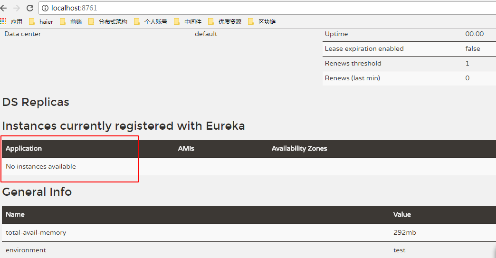
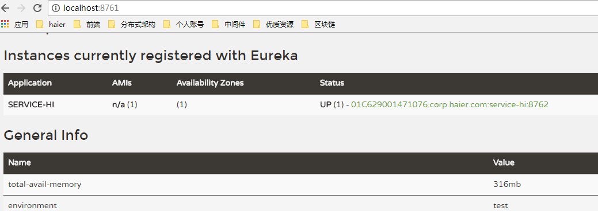
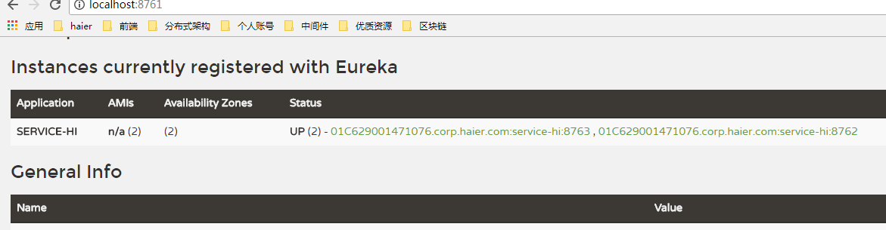
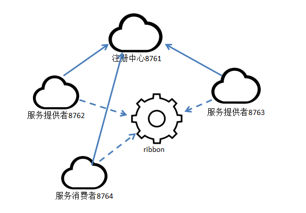
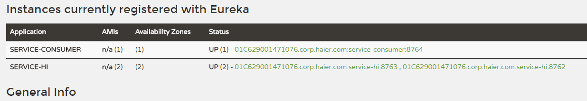

##Spring Cloud
[代码地址：https://github.com/jedyang/springCloud](https://github.com/jedyang/springCloud)

springcloud中文社区给的定义是**微服务架构集大成者，云计算最佳业务实践**。  
我的理解是分布式服务全家桶。  
如果你有dubbo或其他分布式框架的使用经验，那么对springcloud提供的特性是很好理解的。  
springcloud提供了如下特性：  
- 分布式配置
- 服务注册和发现
- 路由
- 远程服务调用
- 负载均衡
- 断路器
- 全局锁
- 主从选举和集群状态
- 分布式消息

### 主要项目
#### spring cloud config
springcloud的配置管理项目，使用git管理。可根据不同环境管理不同参数。也可用于非spring应用。
#### Spring Cloud Netflix  
Spring Cloud包含了非常多的子框架，其中，Spring Cloud Netflix是其中一套框架，由Netflix开发后来又并入Spring Cloud大家庭，它主要提供的模块包括：服务发现（Eureka），断路器（Hystrix），智能路由（Zuul）和客户端负载平衡（Ribbon）。  

####Spring Cloud Bus
事件总线。使用分布式消息将服务和服务实例联系起来。在集群的状态变化传播中作用很大。  

#### Spring Cloud for Cloud Foundry  
让你的应用同Cloudfoundry进行整合。（Cloudfoundry是最近很热的开源PaaS云平台）。让你很容易实现SSO（单点登录）、OAuth2（一个关于授权的开放网络标准）功能，以及Cloudfoundry的服务分发器。  

#### Spring Cloud Cloud Foundry Service Broker  
提供了一个扩展点，以便于开发基于 Cloud Foundry管理的服务分发器。

#### Spring Cloud Cluster
主从选举。基于zookeeper，redis，hazelcast（hazelcast是一个开放源码集群和高度可扩展的数据分发平台），consul（支持多数据中心下，分布式高可用的，服务发现和配置共享）的抽象和实现。  

#### Spring Cloud Consul
基于Consul实现的服务发现和配置管理

#### Spring Cloud Security
提供了对OAuth2 负载均衡的客户端，以及基于Zuul代理的头部校验。  

#### Spring Cloud Sleuth
对spring cloud分布式应用的服务链路追踪

#### Spring Cloud Data Flow  
一个建立数据集成和实时处理管道的工具集。   
简化了应用程序的开发和部署 将精力集中到数据处理的用例上。

#### Spring Cloud Stream  
一个轻量级的事件驱动的微服务框架。可以快速构建应用和外部系统对接。可以在springboot应用之间通过简单的声明模型，基于kafka或rabbitMq交互消息。

#### Spring Cloud Stream App Starters  
一个基于springboot的同外部系统的集成应用

#### Spring Cloud Task  
短时任务处理框架。如定时任务。  

#### Spring Cloud Task App Starters  
对应的具体应用。 

#### Spring Cloud for Amazon Web Services  
方便同AWS服务集成

#### Spring Cloud Connectors  
使各种PaaS平台应用连接基础后端服务（如数据库服务、消息中间件）更容易。

#### Spring Cloud Starters
用于使基于springcloud的依赖管理更方便

#### Spring Cloud CLI  
是一个插件，可以用groovy语言快速创建spring cloud应用

#### Spring Cloud Contract  
是一个消费者驱动的、面向Java的契约框架。  

##Spring Cloud Netflix
Netflix是spring cloud的核心框架，必学必用。
### 微服务架构
首先，我们来看看一般的微服务架构需要的功能或使用场景：

1. 我们把整个系统根据业务拆分成几个子系统。

2. 每个子系统可以部署多个应用，多个应用之间使用负载均衡。

3. 需要一个服务注册中心，所有的服务都在注册中心注册，负载均衡也是通过在注册中心注册的服务来使用一定策略来实现。

4. 所有的客户端都通过同一个网关地址访问后台的服务，通过路由配置，网关来判断一个URL请求由哪个服务处理。请求转发到服务上的时候也使用负载均衡。

5. 服务之间有时候也需要相互访问。例如有一个用户模块，其他服务在处理一些业务的时候，要获取用户服务的用户数据。

6. 需要一个断路器，及时处理服务调用时的超时和错误，防止由于其中一个服务的问题而导致整体系统的瘫痪。

7. 还需要一个监控功能，监控每个服务调用花费的时间等。

### Netflix
Spring Cloud Netflix框架刚好就满足了上面所有的需求，而且最重要的是，使用起来非常的简单。Spring Cloud Netflix包含的组件及其主要功能大致如下：

1. Eureka，服务注册和发现，它提供了一个服务注册中心、服务发现的客户端，还有一个方便的查看所有注册的服务的界面。 所有的服务使用Eureka的服务发现客户端来将自己注册到Eureka的服务器上。

2. Zuul，网关，所有的客户端请求通过这个网关访问后台的服务。他可以使用一定的路由配置来判断某一个URL由哪个服务来处理。并从Eureka获取注册的服务来转发请求。

3. Ribbon，即负载均衡，Zuul网关将一个请求发送给某一个服务的应用的时候，如果一个服务启动了多个实例，就会通过Ribbon来通过一定的负载均衡策略来发送给某一个服务实例。

4. Feign，服务客户端，服务之间如果需要相互访问，可以使用RestTemplate，也可以使用Feign客户端访问。它默认会使用Ribbon来实现负载均衡。

5. Hystrix，监控和断路器。我们只需要在服务接口上添加Hystrix标签，就可以实现对这个接口的监控和断路器功能。

6. Hystrix Dashboard，监控面板，他提供了一个界面，可以监控各个服务上的服务调用所消耗的时间等。

7. Turbine，监控聚合，使用Hystrix监控，我们需要打开每一个服务实例的监控信息来查看。而Turbine可以帮助我们把所有的服务实例的监控信息聚合到一个地方统一查看。这样就不需要挨个打开一个个的页面一个个查看。

接下来一个一个看。

## Eureka
作为服务注册与发现的中心。我们的demo分为两部分，一个server，一个client。  这里的server是指注册中心。client是指服务提供者，向注册中心注册服务。

1. 创建一个maven主工程
2. 建一个server模块。  
右键-->new module -->Spring Initializr -->next  
-->填写相关信息-->next  
-->dependencies 选Cloud Discovery-->Eureka Server  
-->finish  

3. 第一个server  

		// 服务注册中心注解
		@EnableEurekaServer
		@SpringBootApplication
		public class ServerApplication {
		
			public static void main(String[] args) {
				SpringApplication.run(ServerApplication.class, args);
			}
		}

	代码非常简单，就是在原来springboot的启动类上加了一个注解。  
	`@EnableEurekaServer`  
	对eureka组件来讲，server和client是一样的，区分一个eureka实例是server还是client，靠的是配置文件。  
4. 配置文件
在resources下建一个appication.yml  
配置如下：
		server:
		  port: 8761
		
		eureka:
		  instance:
		    hostname: localhost
		  client:
		    registerWithEureka: false
		    fetchRegistry: false
		    serviceUrl:
		      defaultZone: http://${eureka.instance.hostname}:${server.port}/eureka/
(注意，yml对于格式要求非常严格，缩进不要搞错)

5. 启动工程
访问http://localhost:8761。可以看到注册中心的界面。
此时还没有服务提供者注册过来。

6. 同创建server一样的步骤，建一个client
7. 代码如下

		@SpringBootApplication
		@EnableEurekaClient
		@RestController
		public class ClientApplication {
		
			@Value("${server.port}")
			String port;
			@RequestMapping("/hi")
			public String home(@RequestParam String name) {
				return "hi "+name+",i am from port:" +port;
			}
		
			public static void main(String[] args) {
				SpringApplication.run(ClientApplication.class, args);
			}
		}

	用`@EnableEurekaClient`表明这是一个client

8. 配置文件

		eureka:
		  client:
		    serviceUrl:
		      defaultZone: http://localhost:8761/eureka/
		server:
		  port: 8762
		spring:
		  application:
		    name: service-hi

9. 启动工程
查看http://localhost:8761已经注册进来

配置文件中spring.application.name指定的name就是注册的服务名。  
其他应用调用也是根据这个name来找。  

## ribbon+restTemplate
微服务架构中，业务被拆分成单独的服务，服务之间通过rest相互调用。在springcloud中有两种调用方式：ribbon+restTemplate和feign。  
ribbon是一个负载均衡客户端，可以很好的控制http和tcp之上的行为，feign也是使用ribbon的。  

1. 再启动一个进程  
为了尝试负载均衡，基于上面的工程。改一下client的配置端口，将8762改为8763再启动一个服务提供方client。  
tips：idea默认run 是单实例的，所以再次run main会让你停掉之前的服务。其实在run configration中配置一下，把Single instance only选项勾掉就可以了。  

2. 查看注册中心  
测试应该看到  
  
已经有两个服务注册进来了。

3. 建一个服务消费者
新建一个springboot工程：service-consumer  
在dependency时勾选web、ribbon、eureka discovery

4. 在resources下新建application.yml  
配置：
		
		eureka:
		  client:
		    serviceUrl:
		      defaultZone: http://localhost:8761/eureka/
		server:
		  port: 8764
		spring:
		  application:
		    name: service-consumer

5. 修改启动类  

		@SpringBootApplication
		@EnableDiscoveryClient
		public class ServicveConsumerApplication {
		
			public static void main(String[] args) {
				SpringApplication.run(ServicveConsumerApplication.class, args);
			}
		
			@Bean
			@LoadBalanced
			RestTemplate restTemplate() {
				return new RestTemplate();
			}
		}
	注解@EnableDiscoveryClient作用是向注册中心注册自己为消费者。  
	
	@LoadBalanced表明开启负载均衡功能。  
	@Bean注解声明一个RestTemplate bean  

6. 建一个服务类

			@Service
		public class HelloService {
		
		    @Autowired
		    RestTemplate restTemplate;
		
		    public String sayHello(String name) {
		        return restTemplate.getForObject("http://SERVICE-HI/hi?name=" + name, String.class);
		    }
		}

7. 建一个对应的测试用例  

		@RunWith(SpringRunner.class)
		@SpringBootTest(classes=ServicveConsumerApplication.class)
		public class HelloServiceTest {
		
		    @Autowired
		    HelloService helloService;
		
		    @Test
		    public void sayHello() throws Exception {
		        for (int i = 0; i < 10; i++){
		            System.out.println(helloService.sayHello("yunsheng"));
		        }
		
		    }
		
		}
跑十次看一下结果。
	
		hi yunsheng,i am from port:8763
		hi yunsheng,i am from port:8762
		hi yunsheng,i am from port:8763
		hi yunsheng,i am from port:8762
		hi yunsheng,i am from port:8763
		hi yunsheng,i am from port:8762
		hi yunsheng,i am from port:8763
		hi yunsheng,i am from port:8762
		hi yunsheng,i am from port:8763
		hi yunsheng,i am from port:8762

很明显看到了负载均衡的效果。  

当前我们的应用架构是：

## feign
Feign是一个声明试的web服务客户端。可以让你写web service client更简单。Feign默认集成了Ribbon。  
还是使用上面的工程，知识需要加一个Feign的依赖。  
	
        <dependency>
            <groupId>org.springframework.cloud</groupId>
            <artifactId>spring-cloud-starter-feign</artifactId>
        </dependency>

1. 新建一个启动类  

		@SpringBootApplication
		@EnableDiscoveryClient
		@EnableFeignClients
		public class FeignConsumerApplication {
		
			public static void main(String[] args) {
				SpringApplication.run(FeignConsumerApplication.class, args);
			}
		
		}

	新增一个`@EnableFeignClients`注解开启Feign功能

2. 新建一个feign服务类

		@FeignClient(value = "service-hi")
		public interface FeignConsumeService {
		
		    @RequestMapping(value = "/hi",method = RequestMethod.GET)
		    String sayHiFromClientOne(@RequestParam(value = "name") String name);
		}
这里的功能就是一个服务代理的接口，只是内部默认实现了负载均衡。  
这里的requestMapping必须是服务提供者的RequestMapping保持一致。

3. controller层对外暴露一个服务调用

		@RestController
		public class HiController {
		    @Autowired
		    FeignConsumeService feignConsumeService;
		
		    @RequestMapping(value = "/feignHi", method = RequestMethod.GET)
		    public String sayHi(@RequestParam(value = "name") String name){
		        return feignConsumeService.sayHiFromFeign(name);
		    }
		
		
		}
这里的requestMapping随便写。
4. 启动。

	可以看到消费者已经注册。  

5. 消费
因为我们开放的是rest服务，所以直接浏览器测试。
浏览器多次访问  
http://localhost:8764/feignHi?name=yunsheng   
可以看到负载均衡的效果，间隔调用8762和8763的服务。  

## Hystrix断路器
在微服务架构中，各个服务模块独立部署。但是由于各种原因，并不能保证服务100%成功。如果某个服务发送异常，产生线程阻塞。测试有大量请求进入，会导致servlet线程被耗尽。由于服务之间的依赖，导致耽搁服务的异常被传播扩大，产生灾难性后果。为了避免这种情况，业界采用断路器模式，当服务不可用情况达到一定阈值后，断路器打开，避免故障传播。  

1. 添加依赖  
基于service-consumer工程添加依赖
		
		<dependency>
		    <groupId>org.springframework.cloud</groupId>
		    <artifactId>spring-cloud-starter-hystrix</artifactId>
		</dependency>
2. 改造启动类
		
		@SpringBootApplication
		@EnableDiscoveryClient
		@EnableHystrix
		public class ServicveConsumerApplication {
		
			public static void main(String[] args) {
				SpringApplication.run(ServicveConsumerApplication.class, args);
			}
		
			@Bean
			@LoadBalanced
			RestTemplate restTemplate() {
				return new RestTemplate();
			}
		}

	添加`@EnableHystrix`注解，开启断路器功能

3. 改造HelloService

		@Service
		public class HelloService {
		
		    @Autowired
		    RestTemplate restTemplate;
		
		    @HystrixCommand(fallbackMethod = "sayErr")
		    public String sayHello(String name) {
		        return restTemplate.getForObject("http://SERVICE-HI/hi?name=" + name, String.class);
		    }
		
		    public String sayErr(String name) {
		        return "hi,"+name+",sorry,error!";
		    }
		}
给之前的sayHello方法添加@HystrixCommand注解，并指定失败时调用的方法。  

4. 测试
先将8762和8763两个服务提供者关掉。  
先将 @HystrixCommand(fallbackMethod = "sayErr")注释掉，关闭断路器。  
为了方便看出效果。也给ribbon方式新建一个rest的controller。  

		@RestController
		public class HiController {
		    @Autowired
		    HelloService helloService;
		
		    @RequestMapping(value = "/ribbonHi", method = RequestMethod.GET)
		    public String sayHi(@RequestParam(value = "name") String name) {
		        return helloService.sayHello("yys");
		    }
		
		
		}

浏览器访问http://localhost:8764/ribbonHi?name=yys  
需要等到响应超时才能得到错误页面。  
但是开启了断路器之后，  
再次尝试，可以看到很快输出`hi,yys,sorry,error!`。  

  