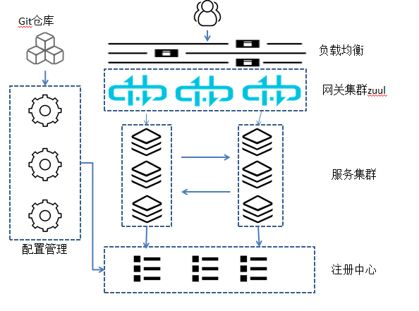
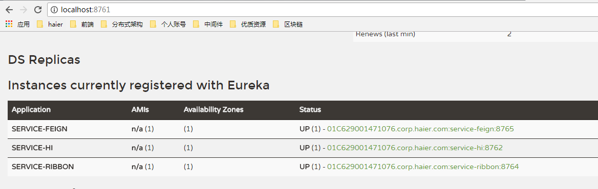
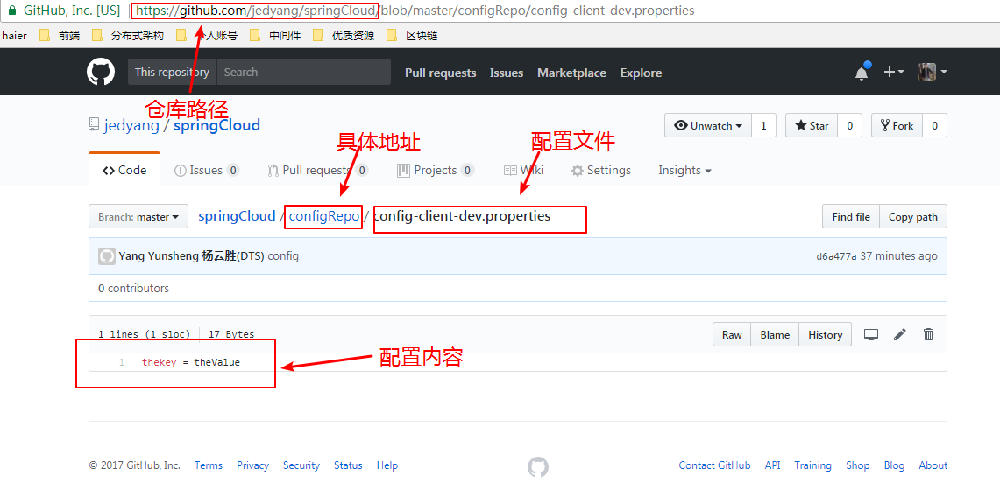

## Zuul
先来看一个简单的微服务架构图。

用户请求通过负载均衡nginx，网关路由zuul，到达服务层。服务统一注册在注册中心Eureka，配置项同意在配置中心管理，配置托管在git仓库。  

Zuul的主要功能是路由转发和过滤。路由转发可以类比spring的servlet-mapping功能。zuul默认已集成ribbon负载均衡。    

1. 新建一个工程zuul  
创建时勾选web、eureka discover、zuul  

2. 代码开启zuul功能 

		@EnableZuulProxy
		@EnableEurekaClient
		@SpringBootApplication
		public class ZuulApplication {
		
			public static void main(String[] args) {
				SpringApplication.run(ZuulApplication.class, args);
			}
		}
	@EnableZuulProxy注解开启zuul功能

3. 改造之前的服务  
在学习ribbon和feign时，我在一个工程里做了演示。现在想要演示zuul路由分发功能，最好将之前的工程拆分一下。我这里就不拆了，通过修改端口号提供两个服务出来。一个service-ribbon在端口8764，另一个service-feign在8765。
这是之前的配置文件：

		eureka:
		  client:
		    serviceUrl:
		      defaultZone: http://localhost:8761/eureka/
		server:
		  port: 8764
		#  port: 8765
		# 切换端口，启动不同服务
		spring:
		  application:
		    name: service-ribbon
		#    name: service-feign

4. 以此启动之前的服务
注册中心8761。  
服务provider在8762。（只启动一个好了）  
服务consumer service-ribbon在8764  
服务consumer service-feign在8765

5. 配置下zuul工程

		eureka:
		  client:
		    serviceUrl:
		      defaultZone: http://localhost:8761/eureka/
		server:
		  port: 8766
		spring:
		  application:
		    name: service-zuul
		zuul:
		  routes:
		    api-a:
		      path: /api-ribbon/**
		      serviceId: service-ribbon
		    api-b:
		      path: /api-feign/**
		      serviceId: service-feign

	以/api-ribbon/ 开头的请求都转发给service-ribbon服务；以/api-feign/开头的请求都转发给service-feign服务；

6. 测试  
浏览器请求http://localhost:8766/api-feign/feignHi?name=yunsheng  
返回`hi yunsheng,i am from port:8762`证明zuul将请求转发给了8765。  
改一下请求http://localhost:8766/api-ribbon/feignHi?name=yunsheng   
返回错误。因为api-ribbon会转发给8764,没有对应的服务。  

### 过滤器功能
除了请求路由以外，zuul另一个重要功能就是filter了。  
代码
		
		@Component
		public class MyFilter extends ZuulFilter {
		    @Override
		    public String filterType() {
		        /* 过滤时机
		        pre：路由之前
		        routing：路由之时
		        post： 路由之后
		        error：发送错误调用
		        */
		        return "pre";
		    }
		
		    /**
		     * 过滤器的优先级
		     * 数字越大优先级越低
		     *
		     * @return
		     */
		    @Override
		    public int filterOrder() {
		        return 0;
		    }
		
		    /**
		     * 该过滤器开关
		     *
		     * @return
		     */
		    @Override
		    public boolean shouldFilter() {
		        return true;
		    }
		
		    /**
		     * 过滤器方法
		     *
		     * @return
		     */
		    @Override
		    public Object run() {
		        RequestContext ctx = RequestContext.getCurrentContext();
		        HttpServletRequest request = ctx.getRequest();
		
		        String username = request.getParameter("name");// 获取请求的参数
		        if (null != username && username.equals("yunsheng")) {// 如果请求的参数不为空，且值为chhliu时，则通过
		            ctx.setSendZuulResponse(true);// 对该请求进行路由
		            ctx.setResponseStatusCode(200);
		            ctx.set("isSuccess", true);// 设值，让下一个Filter看到上一个Filter的状态
		            return null;
		        } else {
		            ctx.setSendZuulResponse(false);// 过滤该请求，不对其进行路由
		            ctx.setResponseStatusCode(401);// 返回错误码
		            ctx.setResponseBody("{\"result\":\"name is not correct!\"}");// 返回错误内容
		            ctx.set("isSuccess", false);
		            return null;
		        }
		    }
		}

测试一下，http://localhost:8766/api-ribbon/ribbonHi?name=yunshen  
返回{"result":"name is not correct!"}  

## 配置中心config
spring cloud的配置项管理是以托管在git仓库中的文件为存储介质。  
配置中心分为两部分：server端负责连接git仓库，得到配置文件。client端负责对外提供api，从server端查询具体配置信息。

### server端
1. 新建工程  
勾选eureka discovert、config server  

2. 代码

		@SpringBootApplication
		@EnableConfigServer
		public class ConfigApplication {
		
			public static void main(String[] args) {
				SpringApplication.run(ConfigApplication.class, args);
			}
		}
还是注解开启对应的功能  

3. 配置  
配置application.properties

		#spring.application.name=config-server
		server.port=8767
		
		
		# 配置git仓库地址
		spring.cloud.config.server.git.uri=https://github.com/jedyang/springCloud/
		# 仓库路径
		spring.cloud.config.server.git.searchPaths=configRepo
		# 仓库的分支
		spring.cloud.config.label=master
		# 用户名和密码，例子的是公开仓库，不需要
		#spring.cloud.config.server.git.username=your username
		#spring.cloud.config.server.git.password=your password

4. 创建配置文件  
这是我创建的配置文件  

5. 测试  
 http://localhost:8767/thekey/dev/master  
看到响应：    
{"name":"thekey","profiles":["dev"],"label":"master","version":"d6a477aa1da5862e9e42553d644e136efbea9296","state":null,"propertySources":[]}  
但是。。其实这只代表能访问到仓库的某个分之下，并不是真的配置内容。  
比如访问http://localhost:8767/a/a/  
依然能得到响应：  
{"name":"a","profiles":["a"],"label":null,"version":"d6a477aa1da5862e9e42553d644e136efbea9296","state":null,"propertySources":[]}  
从响应中我们也可以看出，比如访问http://localhost:8767/a/b/c时，a代表应用名（在client中配置，现在是在server工程，不要急），b是环境如dev、test，c代表git上的分支，现在只有master（所以要么不写，写错会报错）。  

还有其他访问方式：  

	/{application}/{profile}[/{label}]
	/{application}-{profile}.yml
	/{label}/{application}-{profile}.yml
	/{application}-{profile}.properties
	/{label}/{application}-{profile}.properties、

### client端
1. 新建工程  
勾选web、config client
2. 配置  
这里是配置bootstrap.properties。一定要注意啊。坑。

		spring.application.name=config-client
		spring.cloud.config.label=master
		spring.cloud.config.profile=dev
		spring.cloud.config.uri= http://localhost:8767/
		server.port=8768
	最终对应的文件是spring.application.name-spring.cloud.config.profile.properties

3. 代码

		@SpringBootApplication
		@RestController
		public class ConfigClientApplication {
		
		    public static void main(String[] args) {
		        SpringApplication.run(ConfigClientApplication.class, args);
		    }
		
		    @Value("${thekey}")
		    String theValue;
		
		    @RequestMapping(value = "/getValue")
		    public String getValue() {
		        return theValue;
		    }
		}
	做一个rest服务查询下配置的值。  
	原理就是通过@Value注解取值
4. 测试
访问http://localhost:8768/getValue  
得到配置的值