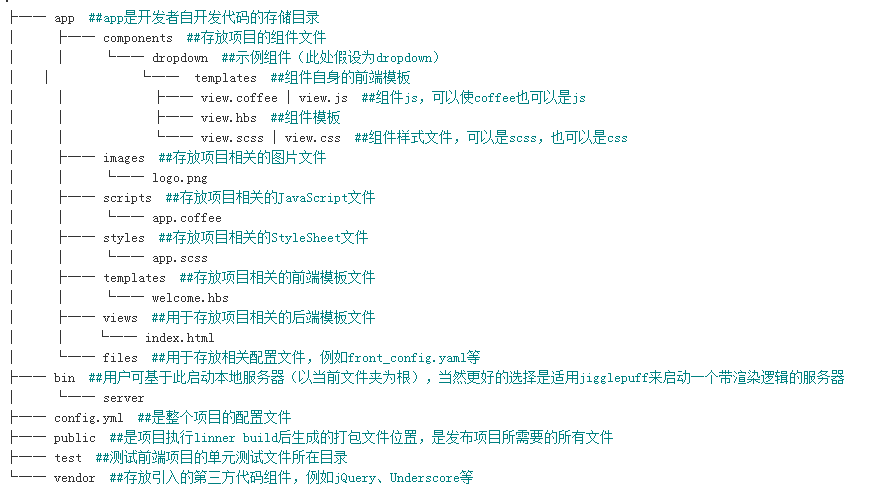

## linner
#### 1，linner是啥
一个html5应用打包器
#### 2，为什么要用
参考链接：  
https://ruby-china.org/topics/12507   
http://ruby-china.org/topics/25802
#### 3，怎么使用
#####1， 下载安装linner：  
1. 安装ruby  
2. 安装RubyGems    
	`ruby setup.rb`   
3. 安装DevKit  
	`ruby dk.rb init`     
	`随后编辑该目录下生成的config.yml文件，在文件最后增加Ruby安装目录`  
	`ruby dk.rb review`  
	`ruby dk.rb install`  
4. 安装linner  
	`gem install linner`  
注意，这里要改下gem源，由于linner安装实际上是从 rubygems.org 获得的，而其被墙，所以，需要寻找国内的镜像进行安装。参见https://gems.ruby-china.org/
	```
	$ gem sources --add https://gems.ruby-china.org/ --remove https://rubygems.org/```
	```$ gem sources -l```
	`https://gems.ruby-china.org # 确保只有 gems.ruby-china.org`
	
	这里必须吐槽下，换好国内源后，我在这里也失败多次，最后发现是公司网络的原因。

##### 2，开始使用
最简单的demo  
1. linner new demo  
2. linner watch  
监控资源更新  
3. 启动server
如果是*nux系统的，直接启动。  
windows的改成bat执行。  
也可以看下内容就一句启动命令，拷出来执行即可。  
4.浏览器看效果吧  
从启动命令`ruby -run -e httpd "./public" -p 3000
`可以看到端口是3000。  
那么，http://localhost:3000/index.html看效果吧
 
###3,linner工程结构

